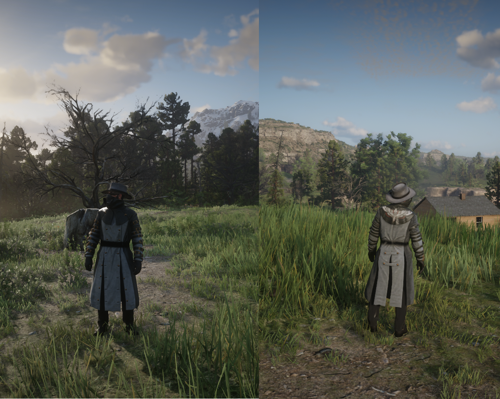
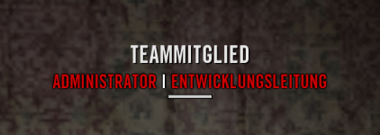

# TEAMMITGLIEDER IC

Mitglieder des Serverteams kümmern sich um den reibungslosen Ablauf im Spiel. Dazu müssen Sie zwangsweise in ihrer Suppottätigkeit erkenntlich sein.

## Wie erkenne ich ein Teammitglied, wenn ich es IC sehe?

Teammitglieder sind IC an Ihrer Kleidung und/oder an Ihrem Admin-Tag zu erkennen. <Badge type="danger" text="Es ist nicht erlaubt den im Bild sichtbaren Mantel zu tragen, unabhängig von der Farbe."/>

_Hier ein Beispiel der Kleidung:_

_Hier ein Beispiel des Admin-Tags:_

## Wie verhalte ich mich, wenn ich ein Teammitglied IC sehe?

Grundsätzlich werden Teammitglieder IC nichtmals angespielt. Solltet Ihr ein Teammitglied sehen so ist diese Person für euren Charakter nicht sichtbar. Alle Anspielungen von anderen Spielern können gänzlich ignoriert werden. Desweiteren sind keine Ausdrücke wie "_Hier ist ein komischer Windzug._" oder "_Ich habe das Gefühl wir werden beobachtet._" etc. gewünscht. 

Sollte ein Teammitglied von selbst auf euch zukommen ist die aktuelle RP-Situation solange zu unterbrechen, wie die Kommunikation stattfindet es sei denn das Teammitglied vor Ort trifft eine andere Aussage.

:::danger ACHTUNG
Das Anspielen von Teammitgliedern im Roleplay kann zu einer Verwarnung und im schlimmsten Fall zu einem Ausschluss vom Server führen
:::