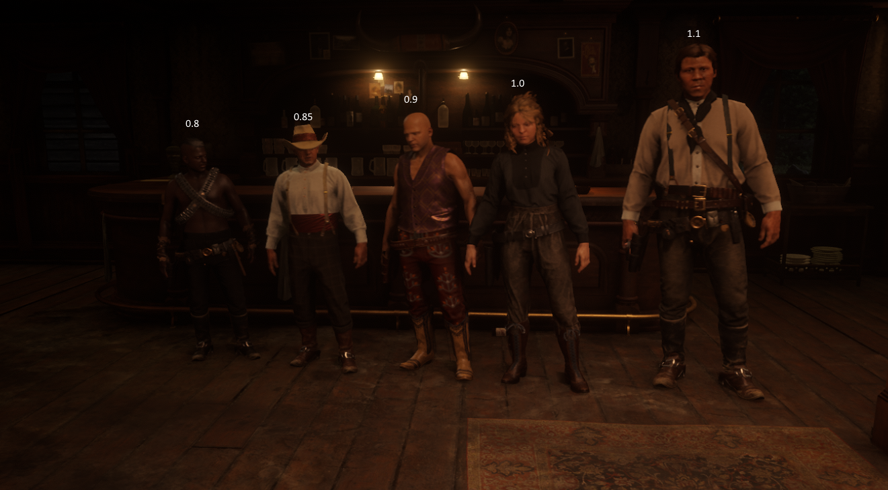

# CHARAKTER

Der "Charakter" ist deine Spielfigur, welche du auf Der Wilde Westen RP bespielst. Es ist möglich über den Support einen Zweitcharakter zu beantragen, ein Spieler kann somit maximal **2 Charaktere** haben.

## Namensgebung des Charakters

_Grundsätzlich kann jeder Spieler den Namen seines Charakters frei wählen, allerdings muss er gewissen Vorgaben des Serverteams entsprechen._  Was du beachten musst:

- Der Name deines Charakters darf keinem Namen einer bekannten realen / fiktiven Person entsprechen. (z.B. Jhonny Cash, Wyaat Earp, Billy the Kid, etc.)
- Dein Name darf keine Sonderzeichen enthalten. Sonderzeichen sind z.B. `'`, `!`, `-`, usw. <Badge type="tip" text="Ä, Ö und Ü sind davon ausgenommen."/>
- Der Name deines Charakters sollte bereits im Jahre `1875` vorhanden sein.
- Beim Erstellen deines Charakters musst du darauf acht geben, dass du den Namen im Format `Vorname Nachname` eingibst, solltest du deinen Namen anders eingeben kann dies zu Anzeigefehlern führen.

## Charaktergrößen

Bei der Auswahl der Charaktergröße sind vier Optionen möglich, die Größen variieren von `sehr klein` bis `größer`. 

## Zweitcharaktere

Wie oben bereits angesprochen hat jeder Spieler die Möglichkeit einen Zweitcharakter zu bespielen, solange er die [Anforderungen](https://sites.google.com/view/dww-regelwerk#h.h0sflfkvp37w) für diesen erfüllt. Wenn der Wunsch nach einem Zweitcharakter besteht kann man im [Discord](https://discord.gg/dww-rp) ein Ticket der entsprechenden Kategorie eröffnen. Alle Informationen, die wir benötigen, stehen in der Nachricht wenn das Ticket eröffnet wird.

::: warning ACHTUNG
Es besteht kein Anspruch auf einen Zweitcharakter. Das Serverteam behällt sich vor aufgrund von Regelverstößen den Zweitcharakter jederzeit zu entfernen. Es darf keine Interaktion zwischen Zweitcharakter und Hauptcharakter geben.
:::

## Charakterwechel und Chartod

<Badge type="danger" text="Ein Charaktertod ist entgültig und kann nicht vom Support rückgängig gemacht werden."/>

Wenn du deinen Charakter gelöscht haben möchtest, wende dich bitte per Ticket an den Support. Hierbei ist zu beachten, dass ein Charakter **mindestens 4 Wochen bespielt werden muss**, eh ein neuer Charakter beantragt werden kann.

Bei der Einreichung des Tickets wirst du hier dann nochmal explizit zur Löschung, sowie nach der neuen Char-Story gefragt und dein Account verifiziert, bevor die entgültige Löschung der Daten stattfindet.

::: danger WICHTIG
Damit ein Charaktertod vollzogen werden kann ist es zwingend notwendig, dass alle alten RP-Stränge vorher beendet sind. Bei dem Wunsch nach einem Charaktertod dürfen keine Besitztümer des Charakters mehr weitergegeben werden. Es ist ebenfalls verboten Besitztümer von dem alten auf den neuen Charakter zu übertragen.
:::
