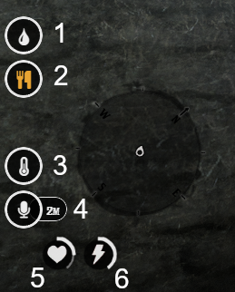
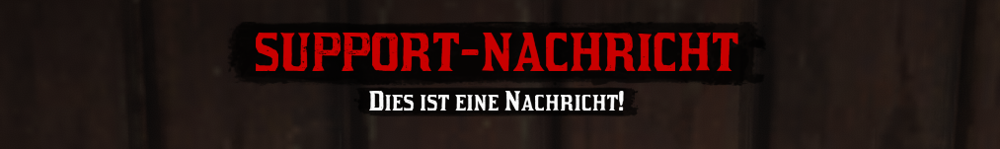
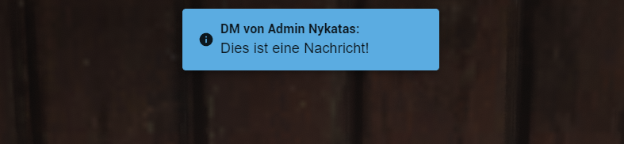

# HUD

Das HUD (Head-up display) zeigt dir im Spiel alle wichtigen Informationen zum Status deines Charakters an.

## HUD-Elemente

Das allgemeine HUD befindet sich unten links in der Ecke des Bildschirms. (_Zahlen 1-6 nur zur Nummerierung, im Spiel nicht vorhanden._)

| Nummer |                    Bedeutung                    | Mögliche Werte                                                                  |
| :----- | :---------------------------------------------: | :------------------------------------------------------------------------------ |
| 1      |            [Trinken](metabolism.md)             | Nicht angezeigt => >75%  Weiß => 75%-50% Gelb => 50%-25% Rot => 25%-0% |
| 2      |             [Essen](metabolism.md)              | Nicht angezeigt => >75%  Weiß => 75%-50% Gelb => 50%-25% Rot => 25%-0% |
| 3      | [Temperatur](time-and-temperatur.md#temperatur) | Weiß => Normal Blau => Zu kalt Rot => Zu warm                             |
| 4      |                Sprachreichweite                 | Weiß => Normal Grün => Sprechen Durchgestrichen => Gemuted                |
| 5      |                   Gesundheit                    | Red Dead Redemption Standard                                                    |
| 6      |                    Ausdauer                     | Red Dead Redemption Standard                                                    |

## 32 Spieler Warnung

Bei der 32 Spielerwarnung erhaltet Ihr zwischen der Essensanzeige und der Temperatur ein Icon sowie eine Benachrichtigung in der oberen linken Hälfte des Bildschirms. Wenn diese Nachricht kommt sollte dieses Gebiet unmittelbar verlassen werden, außer man ist im Roleplay an die Zone zwingend gebunden.

:::warning AUSNAHME
Bei geplanten Großveranstaltungen welche friedlich sind (z.B. Kirche, Theater, Aufführung) darf die 32 Spieler-Grenze umgangen werden.
:::

## Support Benachrichtigungen

Sollten Mitglieder des Serverteams euch eine Nachricht senden wird diese in der _oberen Mitte eures Bildschirms_ erscheinen - es gibt hier 2 verschiedene Nachrichten, welche gesendet werden können.

