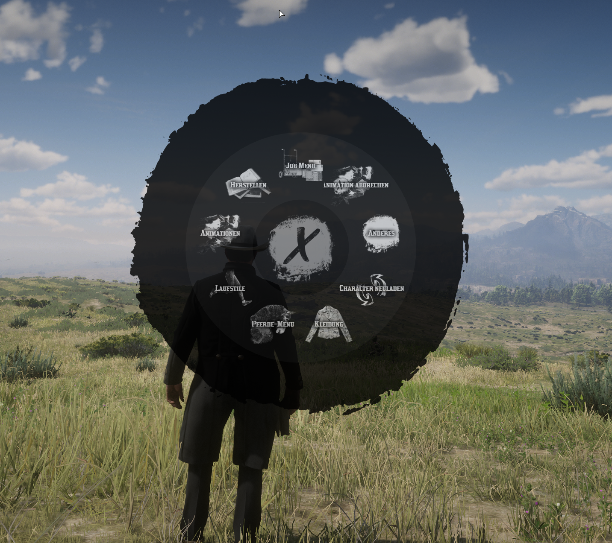
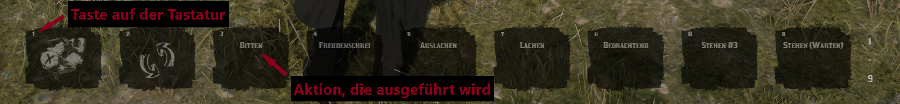

# DAS RADIAL MENU

Das Radial-Menu (aufrufbar über `F6`, siehe [Tastenbelegung](https://wiki.der-wilde-westen-rp.de/sites/keyboard-console/tastaturbelegung)) ist das Grund-Interaktionsmenu auf Der-Wilde-Westen-RP. Alle Grundfunktionen sind in diesem Menu vereint.

## AUFBAU DES RADIAL MENUS

Das Radial-Menu ist, wie der Name bereits verrät, als Kreis aufgebaut. Es gibt verschiedene Untermenus die durch Hovern (bewegen des Mauszeigers auf die Menu-Option) aufgerufen werden können.
Es gibt Untermenus, die klappen sich ohne vorherigen Klick auf (bsp. wenn diese nur eine zusätzliche Reihe haben), andere müssen angeklickt werden, damit die unteren Optionen sichtbar werden.

## HOTBAR INNERHALB DES RADIAL MENUS
<Badge type="tip" text="NEU: Verfügbar am dem Patch am 12.01.2025 / 16:00 Uhr."/>

Das Radial-Menu bietet die Möglichkeit zusätzliche Slots für verschiedenste Animationen & Funktionen des Radial Menus auf eine Hotbar zu binden.
Diese Hotbar hat `9 Slots` und jeder Spieler hat `9 verschiedene Hotbars` zur Verfügung. Die Hotbars können sowohl mit den Pfeiltasten (`↑` & `↓`) als auch mit dem Mausrad gewechselt werden.
Hotbar Slots können entfernt werden, indem man mit der Maus auf die Zugewiesene Aktion geht und diese anschließend durch Klicken entfernt.

