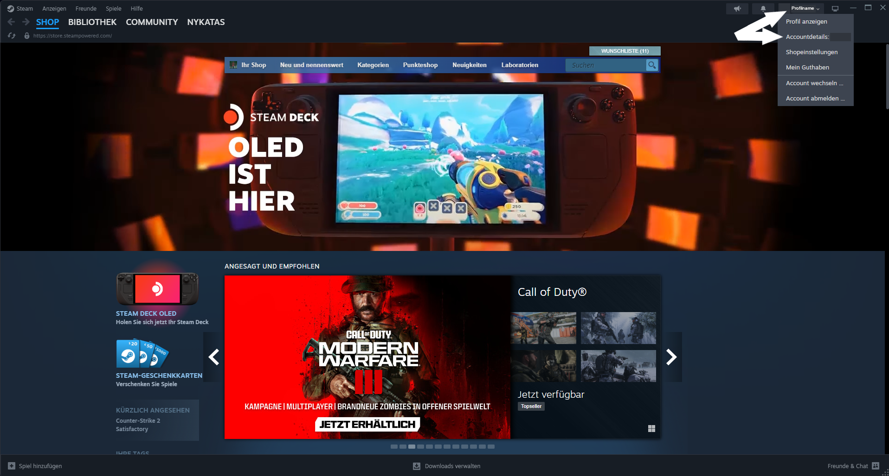
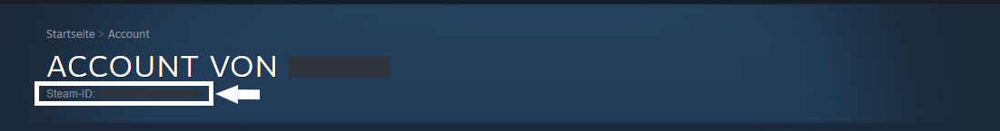
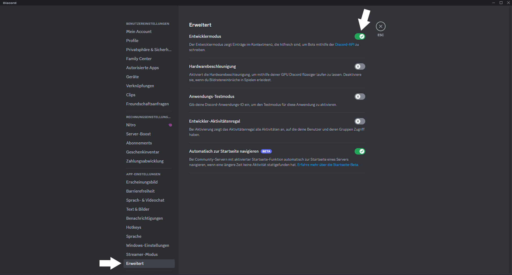
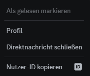

# STEAM-ID & DISCORD-ID

## Wie finde ich meine Steam-ID?

### Schritt 1

Starte Steam & öffne das Account-Menü, indem du auf deinen Steam-Namen oben rechts klickst. Wähle dort Accountdetails aus.

### Schritt 2

Auf der Seite, welche dann aufgerufen wird findest du deinen Accountnamen und darunter deine Steam-ID.

## Wie finde ich meine Discord-ID?

### Schritt 1

Aktiviere die Entwicklereinstellungen bei Discord indem du die Einstellungen öffnest, "Erweitert" auswählst und die Option "Entwicklermodus" aktivierst.

### Schritt 2

Mache nun einen Rechtsklick auf deinen Nutzername in einem Char und wähle "Nutzer-ID kopieren" aus.

