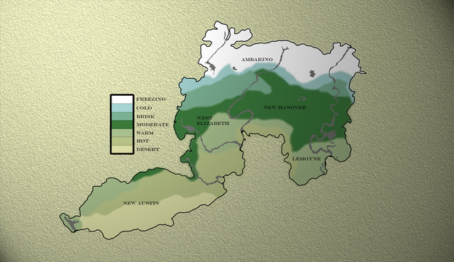

# ZEIT

24 Stunden normale Zeit sind 4 Tage im Spiel, nach jedem Ingame Tag gibt es einen Server-Restart. Somit dauert `1 Ingame Tag` genau `6 Stunden`. Das hat den Hintergrund das wir nicht möchten, dass die Spieler, die nur abends nach Arbeit, Familie, Kochen etc. spielen können, immer im Dunklen spielen müssen.

:::tip Absprachen zur Uhrzeit
Verwende für Terminabsprachen einfach die “normale” Uhrzeit - die du natürlich aber nur wissen kannst, wenn du eine Uhr dabei hast. Das ungefähre Schätzen der Uhrzeit anhand der Sonne ist erlaubt.
:::

## Restart Zeiten

Zu einem Server-Restart fährt der Server einmal gänzlich herunter und läd alle Daten neu. Auf Der Wilde Westen RP gibt es pro Tag `2 Restarts`.

| Restart |      Zeit |
| :------ | --------: |
| 1       | 04:00 Uhr |
| 2       | 16:00 Uhr |

Außerhalb dieser Zeiten kann es zum aufspielen von Neuerungen ebenfalls Restarts geben, diese werden allerdings vorher angekündigt. Nach einem Server-Restart wird die Normalzeit im Spiel wieder hergestellt.

## IC-OOC-Uhrzeit Übersetzung
<Badge type="warning" text="Ursprüngliche Übersetzung von Jenny_JeyJey."/>

| Out Of Charakter (OOC) | In Charakter (IC) | Helligkeit |
| :--------------------- | :---------------: | ---------: |
| 00:00 Uhr              |     06:00 Uhr     |  Wird Hell |
| 01:00 Uhr              |     10:00 Uhr     |       Hell |
| 02:00 Uhr              |     14:00 Uhr     |       Hell |
| 03:00 Uhr              |     18:00 Uhr     |       Hell |
| 04:00 Uhr (_Restart_)  |     22:00 Uhr     |     Dunkel |
| 05:00 Uhr              |     02:00 Uhr     |     Dunkel |
| 06:00 Uhr              |     06:00 Uhr     |  Wird Hell |
| 07:00 Uhr              |     10:00 Uhr     |       Hell |
| 08:00 Uhr              |     14:00 Uhr     |       Hell |
| 09:00 Uhr              |     18:00 Uhr     |       Hell |
| 10:00 Uhr              |     22:00 Uhr     |     Dunkel |
| 11:00 Uhr              |     02:00 Uhr     |     Dunkel |
| 12:00 Uhr              |     06:00 Uhr     |  Wird Hell |
| 13:00 Uhr              |     10:00 Uhr     |       Hell |
| 14:00 Uhr              |     14:00 Uhr     |       Hell |
| 15:00 Uhr              |     18:00 Uhr     |       Hell |
| 16:00 Uhr (_Restart_)  |     22:00 Uhr     |     Dunkel |
| 17:00 Uhr              |     02:00 Uhr     |     Dunkel |
| 18:00 Uhr              |     06:00 Uhr     |  Wird Hell |
| 19:00 Uhr              |     10:00 Uhr     |       Hell |
| 20:00 Uhr              |     14:00 Uhr     |       Hell |
| 21:00 Uhr              |     18:00 Uhr     |       Hell |
| 22:00 Uhr              |     22:00 Uhr     |     Dunkel |
| 23:00 Uhr              |     02:00 Uhr     |     Dunkel |

---

# TEMPERATUR

Die verschiedenen Wetterlagen und Klimas im Spiel beeinflussen die Temperatur deines Charakters. Je nachdem wie warm bzw. kalt deinem Charakter ist wird dieser andere Statuseffekte erhalten - diese können ebenfalls zum Tod führen.

_Die aktuelle Temperatur deines Charakters wird dir im HUD neben der Map angezeigt._

## Temperatur-Karte

*Karte, welche die Temperaturen auf der Karte grafisch darstellt:*

## Temperatur beeinflussen

Einfluss auf die Tempeatur hat:
- das aktuelle Wetter
- die aktuelle Tageszeit
- die Kleidung deines Charakters
- das [Essen/Trinken](metabolism.md) deines Charakters
- die Umgebung

Du kannst die Temperatur deines Charakters selbst beeinflussen um dich der aktuellen Umgebung anzupassen.

- Trinke warme Getränke um die Temperatur zu erhöhen,
- stelle dich in die Nähe eines Lagerfeuers um die Temperatur zu erhöhen oder
- Trinke Wasser um die Temperatur zu senken (etc...).

:::warning Welche Temperaturen sind normal?
Alle Temperaturen zwischen +1 und +39 Grad sind unproblematisch. Sollte deine Temperatur darunter sinken verfärbt sich die Anzeige deines HUD blau, sollte sie darüber steigen verfärbt dich die Anzeige deines HUD rot
:::