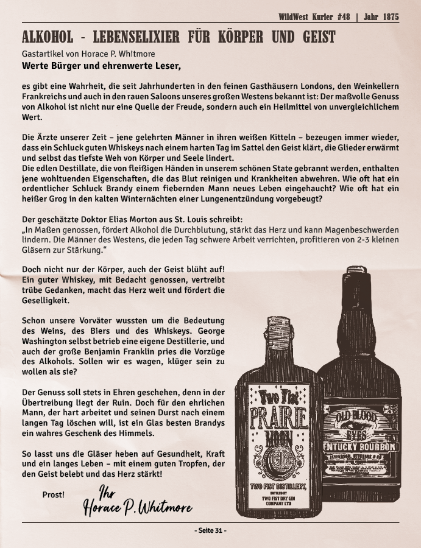

# RP-GUIDE FÜR "DUMMIES” - Zum Leben im Wilden Westen 1875

Die Ära des Wilden Westens begann ungefähr nach dem Ende des Amerikanischen Bürgerkriegs im Jahr 1865 und dauerte bis etwa 1890. Diese Zeit wird oft mit der Erschließung und Besiedlung der Gebiete westlich des Mississippi sowie der damit einhergehenden Gesetzlosigkeit und Konflikten in Verbindung gebracht.

In dieser Zeit zogen viele Einwanderer aller Völker gen Westen, um sich dort beispielsweise mit der Suche nach Gold, als Arbeiter beim Eisenbahnbau oder als Cowboy ein neues Leben aufzubauen.
Afroamerikaner flohen vor Diskriminierung und Gewalt aus dem Süden der USA, Europäer (insb. Deutsche, Iren, Skandinavier und Osteuropäer) sowie Asiaten wanderten wegen wirtschaftlicher Notlagen, Hungersnöte oder politischer Unruhen ein, und auch Mexikaner, die nach dem Mexikanisch-Amerikanischen Krieg (1846–1848) noch immer unter Benachteiligungen zu leiden hatten, erhofften sich hier einen Neuanfang.

Für die Hoffnung, hier ein besseres Leben führen zu können, nahmen die Einwanderer oft harte Bedingungen (fehlende ärztliche Versorgung, Nahrungsmittelknappheit, wenige soziale Kontakte) und Risiken (Banditen, Konflikte mit indigenen Völkern, unerschlossene Gebiete mit gefährlichen Wildtieren) in Kauf – der berühmte „American Dream“ mit Versprechungen von Land, Reichtum und Freiheit nahm einen festen Platz in den Köpfen der Menschen ein.

*Natürlich bedeutet das nicht, dass ihr im RP ständig abgeschafft und mit gebeugtem Rücken umherstraucheln sollt. Dennoch ist eine ernstere, entschleunigtere Herangehensweise ans RP wünschenswert, als es z.B. bei GTA der Fall wäre ("Yay, jetzt erstmal aufs Amt, Geld holen und dann mal schauen wo die Party geht").*

## DAS SETTING

Der Wilde Westen wurde nicht nur aufgrund seiner unerschlossenen Gebiete so benannt, sondern auch deshalb, da in den Randregionen das Gesetz nicht verbreitet war, jeder zumindest mal einen Revolver (*zumeist den IC oft verschmähten Cattleman, auch bekannt als Colt Single Action Army oder Peacemaker - einer der berühmtesten Revolver aller Zeiten*) besaß und Streitigkeiten auch sehr schnell mit dem Tode endeten. Natürlich musste nicht jede Eskalation in einer Schießerei enden, aber gerade damals haben Menschen untereinander viel auf ihren Ruf geachtet, auf Ehre und ihren Rechten beharrt. Mit Sicherheit hat sich niemand, selbst unter Freunden, einfach mit "Du Hund" beleidigen lassen, auch nicht mit einem scherzhaften Lächeln. Eskalationen und Konflikte wurden offen ausgelebt, und sei der Grund auch nur deshalb, jemandem mit einem Schuss vor die Füße vom eigenen Land zu vertreiben.

::: tip
Unsere RP-Spielwelt soll rau sein, der Wilde Westen darf “wild” sein. Anstatt Dinge nur durch vorsichtige Gespräche schlichten zu wollen aus Angst, jemanden auf dem Schlips zu treten, und Gerüchte über einen selbst nur in der eigenen Gruppe zu besprechen, konfrontiert euren Gegner offen, denn ihr habt Ehre und Ruf zu verteidigen und das ist euch 1875 mehr wert als Geld.
:::

Gegensätzlich dazu wurden etablierte Freundschaften gehegt und gepflegt, da man im Fall der Fälle auf die Hilfe seiner Nachbarn in diesen rauen Bedingungen angewiesen war. 

Typischerweise wurde sich nach einem harten Arbeitstag bei einem Lagerfeuer oder dem Wohnzimmer auf der heimischen Farm zusammengesetzt und gemeinsam gegessen und Geschichten erzählt, oder der Abend zusammen im Saloon in der nächsten Ortschaft bei einer Runde Poker mit Tanz und Gesang verbracht.    
Auch Jagd-, Angel- und Schwimmausflüge, ein gemeinsames Picknick oder der Besuch von Stadtfesten, Auktionen, Betriebseröffnungen sind zeitgemäße Beschäftigungen. 

*Veranstaltungen, die nicht ganz zeitgemäß sind, sind in Ordnung, sofern sie RP für viele Mitspieler generieren und nicht einzig auf den Gelderwerb einzelner ausgelegt sind. Speed-Dating gehört im RDR RP allerdings niemals zu einer zeitgemäßen Beschäftigung.*

## 1875, 1899, LETZTES JAHR, NÄCHSTES JAHR …?

Auf „Der Wilde Westen“ bespielen wir dauerhaft das Jahr 1875, auch nach dem realen Jahreswechsel. Der Hintergrund ist einfach: Wir möchten die Blütezeit des Wilden Westens bespielen und nicht dessen Niedergang, wie es im Storymode von Red Dead Redemption 2 im Jahr 1899 der Fall ist.

Die Zeit zwischen 1875 und 1900 war geprägt von einer industriellen und technologischen Revolution, deren Erfindungen das tägliche Leben, die Kommunikation, den Transport und die Industrie tiefgreifend veränderten, wie beispielsweise der Ausbau von Stromnetzen, Erfindung von Telefon, elektrischen Webstühlen, die ersten Hochhäuser mit Aufzügen schossen aus dem Boden, sogar das erste Auto ging in die Massenproduktion.
Diese damals fortschrittlichen Erfindungen waren aber auch das, was den Wilden Westen dann letztendlich auch zähmte, deshalb möchten wir diese technischen Neuerungen auch nicht bespielen. Da es für das Basisspiel nach aktuellem Stand auch keine offiziellen Erweiterungen mehr geben wird, sind wir auch entwicklungstechnisch an das gebunden, was wir aktuell haben.

::: tip Im RP halten wir dies wie folgt...
Wann immer möglich, wird auf das Festhalten der Jahreszahl (z.B. in Schriftstücken) verzichtet, da dies natürlich nach einem realen Jahreswechsel für Verwirrung sorgt, wenn Briefe plötzlich in der Zukunft geschrieben wurden. Stattdessen schreibt man beispielsweise einfach „Am 23. Mai diesen Jahres”.
In Gesprächen geht das weniger holprig, man kann sich mit Aussagen wie “mein Geburtstag letztes Jahr”, “meine Einreise vor 2 Jahren”, “nächstes Jahr werde ich die Ranch übernehmen” festlegen und jeder weiß, was gemeint ist.
:::

*Auch wenn wir immer wieder das Jahr 1875 bespielen, vergeht die Zeit per se natürlich trotzdem - neue Charaktere reisen ein, Geburtstage werden IC gefeiert, Charaktere reisen wieder aus, verschwinden oder versterben.*

## DU UND DEINE UMGEBUNG

Wir haben auf unserer RDR-Map viele verschiedene Biome:
- Saint Denis liegt in einer Sumpfgegend, ist damit schwüler und warm, mit dicker Luft.
- Strawberry dagegen ist nahe am Gebirge und damit schon sehr frisch.
- Armadillo liegt offensichtlich in einer heißen Prärie-Gegend.

*Du wirst also bei ersterem wohl nicht in einem Mantel rumlaufen, beim Zweiten nicht mit aufgeknöpftem Hemd und bei letzterem solltest du tunlichst darauf achten, deine Haut vor der sengenden Sonne zu schützen.*

Aber nicht nur das, auch das Wetter spielt eine Rolle: Regen kann schön anzuschauen sein, ist aber sicherlich nichts, wo man einfach drin stehen bleibt, und schon gar nicht riskierte man damit leicht vermeidbare Erkrankungen.
Kleine Erkältungen konnten schnell zu einer potenziell tödlichen Lungenentzündung werden, und weder eine Arztbehandlung, noch ein Tee wird deinen Charakter von der einen auf die andere Sekunde wieder herumspringen lassen wie einen jungen Adonis. 

::: tip TIPP
Du bist im Wilden Westen fernab von Zivilisation (auch wenn die nächste Stadt eigentlich nur 2 Minuten Ritt entfernt ist), dein Charakter hat sicherlich keinerlei Interesse daran, krank zu werden oder gar den Tod von sich oder seinem Vieh in Kauf zu nehmen. Verhalte dich dementsprechend, ziehe dich passend an und suche dir auch einfach mal einen Unterstand und warte das Unwetter ab.  Du hast die Zeit, das Western-Setting und die Immersion lebt davon!
:::

Auch sollte man sich immer die Frage stellen - ist es sinnvoll, nachts alleine loszuziehen, um einen Grizzly in Tall Trees zu jagen?

*Für die Immersion kann es sehr bereichernd sein, bei seinen Tätigkeiten auch einigermaßen auf die Uhrzeit zu achten. So muss man nicht unbedingt in stockfinsterer Nacht im vollen Galopp umherziehen; außerdem ist es immer sinnig, sich bei einem Ausflug zu vergewissern, ob denn im Fall der Fälle ein Arzt anwesend ist und sich zudem auch irgendwo abzumelden, was wiederum RP für andere generiert, die sich auf die Suche machen können, was einen selbst auch in keinster Weise dann einschränkt und trotzdem realistisch ist.*

## DER ALLTAG IM WILDEN WESTEN

Für die meisten der Einwanderer, die sich für einen ehrlichen Verdienst entschieden, war der Alltag von früh bis spät geprägt von harter körperlicher Arbeit - Männer übernahmen die schweren Aspekte der Feldarbeit, das Versorgen des Viehs oder waren im Militärdienst unterwegs, während Frauen sich oftmals um Hausarbeit, Kinderbetreuung sowie Kochen und Haltbarmachung der Nahrungsmittel kümmerten. Abseits der Farmarbeit verdingten sich Frauen auch als Hebammen, Krankenschwestern oder arbeiteten als Barfrauen und Sängerinnen in Saloons.
Doch hier gab es auch einige Ausnahmen von Frauen, die ebenfalls im Militär gedient oder sich anderweitig mit “eigentlicher Männer-Arbeit” einen Namen gemacht haben.  

::: danger WICHTIG
Im RP sollen trotz Hardcore-Aspekt beiden Geschlechtern die gleichen Berufsmöglichkeiten offeriert werden, sofern dies vom Spieler selbst gewünscht ist (siehe Regelwerk §1 Punkt 2: Sexismus).
:::

Was damals ebenfalls untypisch war, war unsere auf sehr deutsche Art und Weise bespielte Pünktlichkeit.
Jede Siedlung stellte ihre Uhren so ein, dass die Sonne um 12:00 Uhr mittags ihren höchsten Punkt erreichte. Das bedeutete, dass die Zeit von Ort zu Ort leicht variierte. Beispielsweise konnte die Zeit in einer Stadt 10 Minuten hinter der Zeit in einer benachbarten Stadt liegen, was dahingehend bedeutete, dass leichte Verspätungen, sogar bei den Fahrplänen der Bahn, völlig normal und bekannt waren. 

::: tip TIPP
IC wird für Zeitangaben oft „zum X. Glockenschlag“ verwendet. Keine Ahnung welche Glocken hier schlagen sollen, aber die Begriffe a.m. (ante meridiem, „vor Mittag“) und p.m. (post meridiem, „nach Mittag“) stammen offensichtlich aus dem Lateinischen, wurden also bereits seit der Antike verwendet und waren bereits seit dem 18. Jahrhundert fest etabliert. Es ist also völlig legitim, sich um 8 Uhr p.m. am Abend zu verabreden.
:::

## JEDER KANN ALLES?

Im Roleplay begegnen wir oft Charakteren, die mit beeindruckenden Fähigkeiten, tiefen Geschichten und spannenden Entwicklungen brillieren. Dennoch gibt es einen wichtigen Grundsatz, den alle Spieler immer beachten sollten: Kein Charakter ist ein Alleskönner.  Dies ist unrealistisch und macht einen Charakter schnell unglaubwürdig.
Bezogen auf den Wilden Westen bedeutet das, dass nicht jeder automatisch schießen, nicht jeder jagen, nicht jeder mit Lasso, Messer und Wurfäxten umgehen kann, nur weil es der Charakter technisch auf euren Tastendruck hin auch ausführt.

*Ein Charakter mit Fehlern/Schwächen/Marotten bleibt viel eher im Gedächtnis, gerade weil er nicht perfekt ist und dadurch auch mal Hilfe braucht, was schnell RP - auch mit bis dato Unbekannten - generieren kann.*

## RELIGION UND KULTUREN

Im Westen der USA trafen, wie eingangs erwähnt, viele verschiedene Völker mit verschiedensten Kulturen, Ansichten und Religionen aufeinander.
Neben den dominierenden christlichen Konfessionen wie Katholizismus, Methodismus, Baptismus und Lutheranismus gab es auch Quäker, Presbyterianer, Juden, Mormonen, Buddhisten und vereinzelt sogar Muslime.

Die Annahme, JEDER hätte den (christlichen) Gottesdienst besucht und sei gesellschaftlich verstoßen worden, wenn er dies nicht tat, ist also falsch. Nicht jeder war tiefgläubig oder regelmäßig in religiösen Praktiken engagiert. Es gab auch säkulare oder skeptische Siedler, insbesondere in den größeren, multikulturellen Städten des Westens. Und wenn die Kuh, die zum eigenen Überleben immens wichtig war, kalbte, dann musste es selbst bei einem tiefgläubigen Farmer eben auch ein Gebet in den eigenen vier Wänden tun.

Dennoch waren die Kirchen stets gut besucht, denn in der damaligen Zeit wurden diese auch als Schulen, Krankenhäuser oder einfach als Gemeinschaftszentrum genutzt, um sich gegenseitig auszutauschen.

Auch die Behauptung, Geistliche wären immer Männer des Friedens und der Gewaltlosigkeit gewesen, ist falsch. Manche Geistliche waren auch mit Gewalt vertraut: Der episkopale Pfarrer Endicott Peabody aus Tombstone stieg in einen Boxring, um einen Viehdieb zu vermöbeln. Ein Prediger in Mills County, Texas, erschoss mit einem Winchester einen Gesetzlosen, der während einer Predigt auf ihn geschossen hatte. Amen! 

## FEIERTAGE

Alle in der jeweiligen Kultur zur damaligen Zeit bekannten Feiertage gelten IC als bekannt und dürfen normal ausgespielt werden. Zu den wichtigsten amerikanischen Feiertagen gehören: 

- **Unabhängigkeitstag (4. Juli):**

  Der wichtigste nationale Feiertag in den USA, der die Unabhängigkeitserklärung von 1776 feiert. Schon 1875 war der 4. Juli mit Paraden, Feuerwerk und patriotischen Reden ein bedeutender Tag.

- **Thanksgiving Day (vierter Donnerstag im November):**

  Thanksgiving war 1875 bereits ein etablierter Feiertag, nachdem Präsident Abraham Lincoln ihn 1863 offiziell als nationalen Feiertag anerkannt hatte. Es wurde traditionell als Tag des Dankes für die Ernte und andere Segnungen des Jahres mit einem reichhaltigen Familienessen gefeiert.

- **Weihnachten (25. Dezember):**

  Weihnachten war ein bedeutender religiöser und familiärer Feiertag, der schon damals in den meisten Staaten offiziell anerkannt war. Es wurde mit Gottesdiensten, Geschenken und Familienfeiern begangen.

**Weitere Feierlichkeiten:**

- **Grenzöffnung (4. Dezember):**

  Der 4. Dezember 2021 ist der Tag, an dem unser Server live ging. IC darf dieser als der “Tag der Grenzöffnung” ausgespielt und mit Festen, Feierlichkeiten und Feuerwerk, ganz ähnlich dem Unabhängigkeitstag, gefeiert werden. 

- **Ostern (erster Sonntag nach dem ersten Vollmond im Frühling):**

  Osterfeierlichkeiten wurden in christlichen Haushalten oft auf einfachere Weise mit Picknick und kleinen Festen und Treffen der Nachbarn gefeiert. Einzig das Bemalen und Verstecken von Eiern wurde eher in Gemeinden mit deutlich europäischen Einflüssen praktiziert.

- **Halloween (31. Oktober):**

  Irische Einwanderer brachten “Samhain” mit in den Westen. Damals glaubten die Kelten, dass in der Nacht vom 31. Oktober auf den 1. November die Grenzen zwischen dem Reich der Lebenden und der Toten durchlässig werden und so die Geister von Verstorbenen auf der Erde wandeln können. Um die Toten zu besänftigen, wurden Feuer entzündet und Opfergaben in Form von Gemüse, Obst und Tieren erbracht. Damit die Toten die Lebenden nicht als lebendig erkennen konnten, verkleidete man sich mit Fellen und Tiermasken.
  Dekorationen aus Erntegütern wie Heu, getrocknetem Mais und Kürbissen, Verkleiden und kleinere Streiche wie z.B. das Erschrecken anderer, Klappern mit Fensterläden wurden damals in einigen Siedlungen bereits durchgeführt.

  Bereits 1852 war laut Reverend John M. Wilsons Rural Cyclopedia Halloween einer der wichtigsten Feiertage insbesondere der Landbevölkerung in England und Schottland und wurde ausgelassen begangen. Dabei beklagt er die „abergläubischen, heidnischen und höchst tadelnswerten Riten [der Landbevölkerung in Schottland], die gegen den gesunden Menschenverstand, die guten Sitten und die christliche Religion“ verstoßen würden.

  Durch die weitere Vermischung der Einwanderer arteten die Streiche mit Anfang des 20. Jahrhunderts über die Jahre jedoch vielfach in Vandalismus aus, die in zerstörtem Eigentum, auf Dächern umgeparkten Autos, dem Überschütten von Personen mit z.B. Mehl gipfelten, sodass Halloween-Feierlichkeiten ab 1920 teilweise sogar verboten wurden oder nur noch unter offizieller Aufsicht stattfinden durften.  

::: danger ACHTUNG
Im RP bespielen wir zukünftig eine gesunde Mischung der damaligen und heutigen Festivitäten. Dekorationen, Verkleiden, Feste und kleinere Tricks, die als Schabernack und nicht als Übernatürliches erkannt werden dürfen, sind gewünscht und erlaubt.
Das Team behält sich vor, entsprechende Events abzuhalten, die zumeist über das Schwarze Brett und Notizzettel angespielt werden. Diese Events sollen für den Spieler mithilfe dieser Ankündigungen IC logisch erklärbar sein, dennoch darf ein Restzweifel, ob hier alles wirklich so mit rechten Dingen zuging, ausgespielt werden.
:::

## BERUFE

Unser Server bietet durch eine Vielzahl an implementierten Berufen die Möglichkeit, seinen Charakter weiterzuentwickeln.
Dennoch sollte man sich vorher fragen, ob der gewählte Beruf zum Einen sinnig zum eigenen Charakterkonzept ist, und zum Anderen, ob man selbst sowohl die Zeit als auch das OOC-Wissen aufbringen kann, um auch ein eigenes Gewerbe so zu führen, wie es die Mitspieler verdient haben: ein Büchsenmacher sollte wissen, wie ein Gewehr funktioniert, ein Bäcker sollte wissen wie Stockbrot gebacken wird, ein Pferdetrainer sollte den Unterschied zwischen Kalt-, Warm- und Vollblut kennen. 

Und kennst du diese Unterschiede nicht oder hast keine Zeit oder Lust, dich damit zu beschäftigen? Dann sei ein Angestellter, der seinen Beruf im RP erst erlernt, oder einfach Tagelöhner, der sich mit Gelegenheitsjobs - passend zum eigenen Charakter - verdingt, denn Mist schaufeln, Beete harken und Holz schlagen konnte damals jeder. 

*Ein authentisch bespieltes Gewerbe oder jemand, der viel von einem speziellen Thema mit praktischen Tipps weiß, trägt enorm zur Immersion bei und sorgt dafür, dass andere Spieler gerne vorbeikommen!*

## GELD

Wie in diesem Guide mehrfach bereits beschrieben, waren die meisten Einwanderer mehr oder minder Flüchtlinge, die außer dem, was sie am Leib trugen, nicht mehr viel besaßen.
Abgesehen von der Startausrüstung, die für jeden Charakter gleich ist, bleibt es jedoch an dir als Spieler, zu entscheiden, wie du damit umgehst.

Beispielsweise spielt der Großteil der Farmer, die schon lange im State sind, trotz hohem IC-Kontostand aus, dass sie eben „arme Farmer“ sind, weil es authentisch ist - genauso wie ein Charakter mit entsprechender Start-Kleidung und gewählter Sprache der reiche Sprössling eines Ölmagnat sein kann, auch wenn auf dem IC-Konto noch Ebbe herrscht. 

*Es liegt also am Spieler selbst und seiner Kreativität und nicht am Kontostand, wie authentisch der Charakter bespielt werden kann und wie er auf andere wirkt.*

## AUSSEHEN, KLEIDUNG, KORSETTS UND KORSAGEN

Einige der Kleidungsstücke, die von RDR vorgegeben werden, sind dabei für den Großteil der Spieler nicht unbedingt authentisch, wie beispielsweise solche mit Verzierungen mit goldenen Totenköpfen, Kettchen und tausenden Metallschnallen.

Auch Korsetts zählen, außer zu gewissen Anlässen, nicht zur authentischen Kleidung. Korsetts und Korsagen wurden hauptsächlich auf Festlichkeiten und Banketten getragen und waren in erster Linie als ein Stützsystem für die Brust entwickelt worden. Das Korsett wurde aus hartem Material hergestellt und mit Reihen von Nähten versehen, die Walknochen, Schilfrohr oder hanf-ähnliche Materialien fest umschlossen.
Auch Frauen im normalen, zivilen Bereich trugen teilweise verdeckt Korsetts und Korsagen. Gerade aber in Amerika und speziell im Wilden Westen wurde dieses Kleidungsstück, wenn offen getragen, eher den Damen des horizontalen Gewerbes zugesprochen.

Wer jedoch ganz sicher, weder offen noch verdeckt, keine Korsetts trug, waren Damen, die auf ihre körperliche Bewegungsfreiheit angewiesen waren, wie beispielsweise auf Farmen oder in Sheriff Offices. Gerade Sheriffs waren nicht nur Gesetzeshüter, sie waren auch ein Wahrzeichen und Aushängeschild einer Stadt - wenn hier also eine Dame im Korsett ankam, so wäre sie einerseits sicherlich gar nicht in der Lage gewesen, ihrem Job nachzukommen, andererseits wäre sie früher oder später wegen "Verwechslungsgefahr" und dem Nicht-Einhalten der Etikette ganz schnell wieder arbeitslos geworden.

Weiterhin sei auf eine authentische Einfärbung der Kleidung zu achten.
Im Jahr 1875 basierte die Lederfärbung hauptsächlich auf natürlichen Farbstoffen wie pflanzlichen (z.B. Eichenrinde, Walnussschalen, Indigo, Henna) und mineralischen Materialien (z.B. Ocker, Eisenoxid). Zwar war eine gut deckende Einfärbung von Leder mit Hilfe von chemischen Farbstoffen, wie wir sie heute kennen, schon möglich, aber noch relativ neu und daher auch teuer. Kaum ein Cowboy wird sein hart verdientes Geld dafür ausgegeben haben, um sich extra ein rosa Holster anfertigen zu lassen.
Wenn euer Charakter also Leder trägt, dann lasst es bitte auch nach Leder aussehen! Auch Metallschnallen u.ä. können mit Methoden von 1875 nicht deckend in knalligen Farben gefärbt werden. Auch Sattel und Zaumzeug bestanden aus Leder und waren nicht in knallgrün erhältlich. Wenn ihr unbedingt Farbe ins Spiel bringen wollt, so könnt ihr dies z.B. gerne bei Hemden, Shirts, Halstüchern oder sonstigen Schärpen und Bändern aus Stoff oder auch bei Satteldecken aus Wolle tun.

::: tip TIPP
Hübsche Kleidung blieb übrigens selten lange hübsch, wenn sie ständig beim Arbeiten getragen wurde, weshalb zumindest das Tragen bspw. einer Schürze, einer Latzhose oder gleich einem ganzen Set an Arbeitskleidung, passend zum Beruf gewählt - sehr authentisch wirken und zur Immersion einen großen Teil beitragen.
:::

Zum Auftreten eines Charakters gehört natürlich auch das eigentliche Aussehen:
- Ein Bart oder Haare wachsen nicht über Nacht von kurz zu lang.
- Das Färben von Haaren war nicht weit verbreitet - vor allem nicht im Wilden Westen - und wurde überdies als unnatürlich angesehen. Deshalb wurde oft im Verborgenen versucht, mit Hausmitteln, wie z.B. Salbei, Nussöl, Kamille, seltener mit Henna & Indigo, dem Haar einen leichten Farbglanz zu geben oder ergrautes Haar damit zu kaschieren. Wer mit blauen, grünen, rosa Haaren unterwegs sein will und dies am besten noch an 7 Tagen die Woche wechselt, ist im Jahr 1875 ganz falsch unterwegs.

*Auf ein authentisches Erscheinungsbild passend zu Charakter und Tätigkeit sollte schon aus Respekt vor den Mitspielern und deren Immersion geachtet werden.*

## PFERDE

Aus dem Wilden Westen nicht wegzudenken sind natürlich Pferde, da diese sowohl für die Arbeit als auch als Transportmittel unverzichtbar und damit für das eigene Überleben entscheidend waren.
Entsprechend waren Pferde teuer in der Anschaffung und jeder Cowboy hatte neben der typischen (und logischen) Pflegeroutine wie Füttern, Huf- und Fellpflege auch rudimentäre Kenntnisse zur Versorgung von leichten Verletzungen - auch wenn man sehr darauf achtete, dass es gar nicht erst zu Blessuren kam, denn oftmals bedeuteten diese, wenn unbehandelt, den Tod des Tieres. Daher versuchte man, unnötige Verletzungsgefahren von vornherein zu vermeiden, indem man das Pferd erst im Schritt warm laufen ließ, nach längerem Ritt die Beine in einem Bach kühlte oder das schweißnasse Pferd mit Stroh trocken rieb - und sicherlich riskierte man keinen Beinbruch des Tieres, indem man es aus Spaß über Baumstämme springen ließ oder im gestreckten Galopp stundenlang über eine nasse, unwegsame Wiese, am besten noch bergab, hetzte. 

*Die Grundgangart eines Pferdes ist immer noch Schritt und kein Galopp. Ihr müsst nicht ständig von A nach B hetzen, RDR lebt von einer deutlich langsameren Spielwelt als das RP in einer modernen Welt wie GTA. Macht lieber auch mal langsam und genießt die unglaublich schön gestaltete Welt!*

Doch die Beziehung zwischen Pferd und Cowboy war im Gegensatz zu heute eher praktischer und/oder pragmatischer Natur - das Pferd war ein teures Werkzeug, ohne das man oft kein Geld verdienen oder komplett abgeschieden vom Rest der Welt leben musste. Natürlich wurde das Tier daher von einem Besitzer, der etwas auf seine Ehre hielt, nach bestem Wissen und Gewissen gepflegt, wenn es Zeit und Mittel zuließen.
Ein Cowboy, der mehrmals und oft monatelang in seinem Leben mit seinem Pferd auf einem Viehtrieb unterwegs war, konnte zwar eine vertrauens- und respektvolle Beziehung zu seinem Pferd aufbauen - in potentiell tödlichen Situationen war jedoch das eigene Leben immer mehr wert, sodass das Tier im Gegensatz zu heute, wo nennenswerte Gefahren kaum noch auftreten, auch mittels Sporen und Lasso zu Höchstleistungen bis zum Zusammenbruch getrieben wurde, um das eigene Leben zu schützen.

Besonders widerspenstige Pferde wurden “gebrochen”, was sie zwar zu funktionierenden Arbeitstieren machte, ihnen jedoch oft auch jeglichen Lebenswillen raubte oder Verhaltensauffälligkeiten wie bspw. Aggressionen hervorrief.

::: tip TIPP
Zusammenfassend lässt sich also sagen, dass das Pferd zur damaligen Zeit wesentlich weniger als fühlendes Lebewesen, sondern vielmehr als wertvolles Werkzeug und Mittel zum Zweck angesehen wurde. Ein respektvoller Umgang mit dem Tier - wenn auch nicht aus reiner Tierliebe - war dennoch alltäglich und kann im RP leicht ausgespielt werden, indem man bspw. sein Pferd zwischendurch auch mal tränkt und nach dem Ritt absattelt und bürstet, bevor man es wegschickt. Ein allzu „wendy-hafter“, moderner und kuscheliger Umgang mit Pferden ist jedoch nicht zeitgemäß.

Ebenfalls nicht zeitgemäß, bei uns jedoch aus Balancing-Gründen möglich ist das Unfruchtbar-Machen der Pferde durch einen Tierarzt. Deshalb sollte man dies auch ernsthaft und gewissenhaft ausspielen, da diese Operation 1875 sehr oft mit dem Tod des Tieres endete (was im RP natürlich nicht passieren wird).
Wir orientieren uns daher grob am heutigen Stand:
- Wird ein Hengst kastriert, „gewallacht“ oder „gelegt“ (d.h. die Hoden operativ entfernt), wird er damit vom Hengst zum Wallach und dadurch, dass keine Hormone mehr produziert werden können, ruhiger und umgänglicher. Diese Wesensänderung ist gewünscht, weshalb Hengste in der Regel auch immer kastriert und nicht sterilisiert werden.
- Stuten können zwar auch kastriert werden, werden in der Regel aber - wenn überhaupt - nur sterilisiert (d.h. die Gebärmutter bleibt drin, es werden nur die Eileiter durchtrennt; Hormone werden daher weiter produziert und eine Wesensänderung tritt nicht ein). Eine kastrierte oder sterilisierte Stute behält weiter die Bezeichnung Stute, ganz selten wird sie heute im tiermedizinischen Bereich als “Ovari” oder “ovariektomierte Stute” bezeichnet.
:::

Typische Pferderassen, die damals als Reittiere genutzt wurden, waren Morgans und Kentucky Saddler, während Mustangs und vor allem Quarter und Paint Horses (historisch gesehen waren Paints damals keine eigenständige Rasse), letztere beiden wegen des sogenannten Cow Sense, von Cowboys für den Viehtrieb bevorzugt wurden. Für die schwere Feldarbeit auf Farmen waren Clydesdales sehr verbreitet.
Indigene Völker fingen, klauten oder züchteten sich Mustangs heran; dem Stamm der Nez Percé wird beispielsweise die Zuchtentwicklung des heutigen Appaloosas zugeschrieben.
Vollblüter wie Araber, Achal-Tekkiner oder das Englische Vollblut wurden wegen ihres oftmals eher feurigen Temperaments zwar als Renn-, nicht aber als verlässliche Arbeitspferde genutzt, und Kaltblutpferde eignen sich aufgrund ihres Knochenbaus und schweren Gewichts nicht als alltägliche Reitpferde.

*Dennoch achtete man damals sowieso nicht primär auf die Reinrassigkeit - vielmehr war es wichtig, dass das Pferd robust, widerstandsfähig und verlässlich war. Aus Balancing-Gründen für die Wirtschaft ist das Cross-Breeding deaktiviert, dennoch kann man natürlich auch mal ausspielen, dass ein Pferd nicht reinrassig ist.*

## TELEGRAMME

Die elektrische Telegrafie war ein Punkt-zu-Punkt -Textnachrichtensystem, welches hauptsächlich von den 1840er Jahren bis ins späte 20. Jahrhundert verwendet wurde. Der Ablauf war dabei wie folgt: Der Absender ging zu einer Telegrafenstation, um dort ein Formular mit seiner Nachricht (je länger diese Nachricht war, desto teurer war auch die Übermittlung) und der Adresse des Empfängers auszufüllen. Dieser Text wurde von einem ausgebildeten Telegrafisten in Morsezeichen (eine Kombination aus kurzen und langen Signalen, dargestellt durch Punkte und Striche) übersetzt und mittels elektrischer Signale durch Telegrafenleitungen zwischen den Ämtern übertragen. In der Zielstation angekommen, wurde die Nachricht wiederum dekodiert, auf Papier niedergeschrieben und so an den Empfänger ausgehändigt.

Wir alle nutzen Telegramme für unser RP. Betriebe, staatliche Einrichtungen, Familien, die ihren entfernten Verwandten Nachrichten zukommen lassen wollen. Aber muss ich dafür lesen und schreiben können, was 1875 ja nicht Gang und Gäbe war? Nein, denn man konnte dem Telegrafisten die Nachricht auch einfach diktieren oder empfangene Nachrichten entsprechend vorlesen lassen.
Daher ist die Aussage “Ich schreibe mal eben ein Telegramm” faktisch falsch, denn der Charakter schreibt, wenn überhaupt, eine Vorschrift, welche der Telegrafist dann korrigiert und anschließend kodiert. Und auch wenn dein Charakter nicht gut schreiben kann - der Telegrafist  war dafür ausgebildet, sodass Rechtschreibfehler quasi nicht vorkamen. 

::: tip TIPP
Korrekterweise sollten Telegramme daher kurz und prägnant sein, für längere Schreiben gibt es den Post Service.
Außerdem gab es keine absichtlichen Rechtschreibfehler in Telegrammen und schon gar keine „^^“ oder „:)“ oder ein „Hallooooo“ mit 5 O’s - der Telegrafist hätte diese automatisch ausgebessert bzw. auch gar nicht mit übermittelt bzw. dekodiert, denn er wird schließlich dafür bezahlt, einen für jeden lesbaren Text abzuliefern.
Da Tippfehler jedoch natürlich jedem passieren können, sollten diese einfach nicht ausgespielt werden.
:::

## DAS ROLLENSPIEL UM DIE ENGINE & NICHT SO KREATIVE AUSSAGEN

Sprache ist für unser RP das Wichtigste und trägt so viel zur Immersion bei.
So gilt es - wie bei allem anderen eigentlich auch - vorher nachzudenken, was man eigentlich sagen will und wie man es dann auch authentisch rüberbringt.

### Beispiel 1: Jemand hat vor, ein durchtrainiertes Pferd mit 2450 XP zu kaufen

Mit diesem Vorhaben geht er nun zum Pferdetrainer seines Vertrauens und sagt einen der folgenden Sätze:

- "Ich hätte gerne ein Pferd mit einem vollen Herzen.”
- “Ich hätte gerne ein Pferd, welches schnell wie der Blitz ist."
- “Ich hätte gern ein Pferd, an dem der Ring um den Hals möglichst voll ist.”
- “Ich hätte gern ein Pferd, bei dem der Stallbursche eine volle Torte mit 4 Stücken an die Stalltür gemalt hat.”

*Ja, diese Sätze sind tatsächlich im RP gefallen. Hört sich weder schön an, noch logisch, noch immersiv, noch ist dies sonst irgendwie zu rechtfertigen.*
*Wie wäre es also stattdessen mit:*

- "Ich hätte gerne einen [beliebige Pferderasse], ich hab beim Stallburschen im Verkauf einen [beliebige Farbe] gesehen, der sieht doch wirklich gesund und kräftig aus, oder?"
- “Ich hätte gerne einen [beliebige Pferderasse], treiben Sie mir das Beste auf, was Sie finden können!”

*… und schon klingt es so, als würden zwei Menschen ganz normal miteinander reden, ohne auf irgendwelche Spiel-Mechaniken, die man sowieso nicht logisch erklären könnte, einzugehen.*

### Beispiel 2: Jemand kann für 4-5 Tage nicht IC kommen

- „Ich bin für 4-5 Tage nicht da, ich besuche meine Verwandten/Freunde in Europa!“

*Auch unsere Spieler sind an die Gegebenheiten von 1875 gekettet und der Kontinent Europa fängt nicht gleich östlich von Saint Denis an - da ist leider auch etwas mehr Wasser dazwischen als nur der Lannahechee River. Eine Schifffahrt über den Atlantik dauerte je nach Wetterlage mit einem Dampfschiff zwischen 10-14 Tagen, mit einem Segelschiff auch schonmal 6 Wochen und war auch nicht ganz ungefährlich (Stichwort Titanic). Besucht bei solch kurzer Dauer doch einfach Verwandte/Freunde in einem der südwestlichen States der USA.*

### Beispiel 3: Jemand kann wegen einem Bug nicht auf sein Hauptbuch/Kasse zugreifen

- IC-Aussage: „Es geht nicht.“
- OOC-Aussage dazu: „Ich weiß nicht, wie ich das anspielen soll.“

*Prinzipiell sollen Bugs nie angespielt werden, doch leider funktioniert dies in manchen Situationen, beispielsweise wenn man im Beisein eines anderen Spielers eben mal auf sein Hauptbuch zugreifen will und es aufgrund eines Bugs nicht kann (RedM ist ein Modding-Tool und kein eigenständiges Spiel, viele Spieldateien von RDR sind nicht “richtig” entschlüsselt und daher kann es auch immer zu Bugs kommen, denn WIR sind eben auch nicht der Entwickler, weder von RedM noch von RDR). Natürlich sind solch eingreifende Bugs immer ein Grund, ein entsprechendes Ticket aufzumachen, welches im Regelfall aber IC auch nicht angespielt wird.*

*Doch Ausreden a la “S**t, mein Schlüssel zur Schublade ist abgebrochen und steckt jetzt im Schloss fest, jetzt muss ich die Schlösser wechseln lassen, sorry dafür” oder “Die Schranktür klemmt und ich hab kein Öl da” sind absolut legitime Aussagen im RP, die niemanden aus der Immersion reißen, aber dein Gegenüber dennoch darüber aufklären, dass da gerade was nicht wie gewünscht funktioniert und man nicht weiter auf der Situation beharren sollte.*

*Vergesst nicht, RP ist nicht nur Bespaßen-Lassen - euer Gegenüber hat von euch ebenfalls gutes und kreatives RP mit immersiven Aussagen verdient!*

## ICH, DER BÜRGER UND MEIN SHERIFF

Einen Sheriff in der Stadt zu haben, war in 1875 etwas, was jeder Bewohner - selbst, wenn er selbst nicht immer sauber war - unbedingt haben wollte. Sie sorgten für Recht und Ordnung, waren Respektspersonen - auch wenn sie selbst nicht immer sauber waren - und damit für jeden Patrioten das unverzichtbare Wahrzeichen der Stadt.

:::tip TIPP
Der Law & Crime-Aspekt ist das Herzstück eines jeden RP-Servers, weshalb Fairplay hier jederzeit großgeschrieben werden muss! Natürlich soll man sich nicht alles gefallen lassen, aber gerade im Wilden Westen kann man durch das gemächliche Setting manches auch mal deutlich lockerer sehen.
:::

*Aber 1875 hat sicherlich niemand mit einem Sheriff über Gesetze gestritten, ihn beleidigt, sich über ihn lustig gemacht oder als faul bezeichnet, denn dann hätte er sich ganz schnell mit einem blauen Auge in einer Zelle wiedergefunden - oder direkt am Strick. Ein “Der Sheriff hat seine Stellung missbraucht und powert mich!” ist hier völlig fehl am Platz - der Sheriff hat einfach nur zeitgemäß auf eine Konfrontation reagiert, was erst einmal völlig in Ordnung ist. Sheriffs waren keine Fußabtreter der Bevölkerung, sondern respektierte Gesetzeshüter, die 1875 eben härter als heute durchgegriffen haben.*
*Natürlich kann ein Krimineller dennoch ein respektloses Großmaul ausspielen, doch muss er sich der entsprechenden Konsequenzen seiner Handlung dann auch bewusst sein. Kein hochrangiger Sheriff oder gar der Marshal lässt sich von einem zerlumpten Banditen blöd von der Seite anranzen, ohne zu handeln - und dann zu argumentieren, dass Beleidigungen oder respektloses Verhalten eben zum Hardcore-RP dazugehört, nicht aber die resultierende Konsequenz daraus zu respektieren, ist schlicht und ergreifend Fail-RP.*

*Fairplay zielt aber immer in beide Richtungen: Genauso muss ein Sheriff nicht immer auf Biegen und Brechen nach Gesetzbuch überkorrekt Haftstrafen verteilen; es liegt in seiner Verantwortung, auch mal locker über eine Kneipenschlägerei und Kleinkriminalität hinwegzusehen, die Leute eine Ausnüchterung ausspielen und sie ansonsten ohne Strafe von dannen ziehen zu lassen.*

## KRIMINALITÄT

“Kleinkriminelle”, die sich beispielsweise neben ihrem Gewerbe mit Moonshine-Brennen ("Moonshine" bezieht sich auf hochprozentigen Alkohol, der heimlich hergestellt und oft bei Nacht “im Mondschein” gebrannt wurde, um nicht entdeckt zu werden) ein Zubrot verdient haben, waren häufig. Nach dem Amerikanischen Bürgerkrieg (1861–1865) führte die US-Regierung hohe Steuern auf Alkohol ein, um Einnahmen für den Wiederaufbau zu generieren. Diese Steuern machten legal hergestellten Alkohol teuer, sodass so manchem Siedler oft gar nichts anderes übrig blieb, diesen heimlich für sich selbst oder als Tauschmittel herzustellen. Doch im Allgemeinen war dies etwas, was abseits der Öffentlichkeit geschah und somit niemanden außer dem Brenner selbst (wenn ihm bspw. die selbst gebaute Destille um die Ohren flog, oder Behörden auf ihn aufmerksam wurden) gefährlich werden konnte.

Doch die kriminellen Machenschaften einer ganze Bande konnten das alltägliche Leben einfacher Leute in dieser Zeit leicht zerstören. Wenn eine Bande eine Bank ausraubte und eine beträchtliche Summe Geld stahl, dann ist dies natürlich euer Geld (auch wenn mechanisch euer Konto nicht angerührt wird), was hier im Nirvana verschwindet, also seid angemessen schockiert darüber!
Auch Ladendiebstähle oder Geiselnahmen im Zug sind oft gewalttätige Überfälle, die nicht selten mit dem Tod endeten. Macht es also Sinn, dass der Besitzer des General Stores ausdruckslos seine Zigarette weiter raucht und alles bewegungslos beobachtet? Oder zieht er gar seine Revolver und schießt mit?
Nein, tut er nicht - er wird sich in seinen Laden zurückziehen, diesen vielleicht sogar verrammeln, um sein Leben zu schützen.

::: danger ACHTUNG
Auch hier gilt jedoch jederzeit Fairplay: Ballert nicht herum wie die Großen (Munition war teuer), überfallt nicht wahllos Leute ohne RP-Hintergrund, und vor allem schießt sie nicht grundlos nieder und legt sie dann sonstwo ab, wo man die Bewusstlosen nicht finden kann.   
Bedenkt stets, dass ein Überfall ein RP-Event sein sollte, aus dem alle Parteien zufrieden herausgehen - er ist keinesfalls dafür da, andere um alles zu erleichtern und auf Zwang jedes Item mitzunehmen, nur weil es die Regeln erlauben. Man kann Überfälle auch ohne einen Diebstahl machen!
:::

## (ER)KENNE DEINEN FEIND IN 1875
Bevor wir uns anschauen, wie man im Wilden Westen von DWW Täter richtig erkennt und überführt, ist es wichtig, die [grundlegenden Regeln zur Maskierung](https://sites.google.com/view/dww-regelwerk#h.x9p1ciur45wm) zu kennen:
2. Veränderungen des Erscheinungsbildes (z. B. Bandana, Kleidung, Stimme) verschleiern grundsätzlich die Identität.

Eine Identifizierung ist zweifelsfrei möglich, wenn:
-   das Erscheinungsbild nur durch ein Bandana verändert wurde (Bandana hoch oder runter, restliches Aussehen und Ausrüstung bleiben gleich und die Person wird nach kurzer Zeit wieder so gesehen),  
-   oder wenn man selbst beobachtet hat, wie jemand sein Erscheinungsbild verändert hat.  

Nach einer Aggressor-Handlung (z. B. Überfall, Raub, Angriff) dürfen 30 Minuten lang keinerlei Änderungen am Erscheinungsbild vorgenommen werden.  
 
3. Generelle Änderungen am Erscheinungsbild dürfen vorgenommen werden, wenn der Charakter weder aktiv gesucht wird (Steckbrief) noch binnen 72 Stunden an einer kriminellen Handlung beteiligt war. Kleidung darf bereits 30 Minuten nach einer aggressiven Handlung geändert werden.  
  
-> Wichtig: Auch das Lösen der Haare aus dem Zopf in eine offene Mähne ist eine Änderung des Erscheinungsbilds!

### Der Schlüssel zur Überführung

Im Wilden Westen rennt niemand mit einem Ausweis herum, und selbstredend wird es dank Bandana, Kleidungswechsel und verstellter Stimme - vor allem bei einem ersten Aufeinandertreffen - schwer, den Täter direkt zu überführen. Doch selbst wenn man niemanden „zweifelsfrei“ identifizieren kann, heißt das nicht, dass man völlig im Dunkeln tappt.

Auch wenn der Täter nicht anhand der Stimme erkannt werden darf, so kann natürlich der Klang selbst (z.B. tiefe oder hohe Stimme) bereits ein Indiz sein und einem eventuell sogar vielleicht wage bekannt vorkommen, weil man die Person vielleicht vorher auch schon mal ohne Bandana gesehen und mit ihr ein Schwätzchen gehalten hat. Ein einzelnes Indiz reicht aber nicht aus, um jemanden zu erkennen bzw. zu überführen. Aber eine Kombination mehrerer Merkmale kann ein sehr klares Bild zeichnen; daher sollte jede/r Spieler/in, der/die einen Überfall erlebt, lernen, sie zu nutzen.

Beispiele für glaubwürdige und verwendbare Indizien:

-   Anzahl der Beteiligten: Wie viele Personen waren am Überfall beteiligt?    
-   Geschlecht und Statur: Männer oder Frauen? Klein, groß, dick, dünn, muskulös?    
-   Stimme & Sprachmuster: hohe/tiefe Stimme in Verbindung mit gebrochener Sprache, mit/ohne Akzent, wiederholende Phrasen, dumme/intelligente Ausdrucksweise, Stottern, etc.?    
-   Haare: Haarfarbe, Länge, Schnitt, Bart oder Glatze?    
-   Kleidung & Accessoires: Farben, Muster, fehlende Kleidungsstücke (z. B. kein Hut), auffälliger Schmuck, Munitionsgürtel, Halsketten, Schärpen oder verzierte Holster (z. B. Totenköpfe)    
-   Bewaffnung: Welche Waffen trugen sie? Pistolen, Gewehre, Nahkampfwaffen? Gab es auffällige Verzierungen oder eine bestimmte Anzahl?    
-   Pferde: Welche Farben hatten die Pferde? Gab es besondere Sättel oder auffälliges Zubehör?
-   Ablauf & Ort: Wo fand das Ganze statt? Wie lief der Überfall ab? Welche Strategie wurde verwendet? 
    

Es ist von Fall zu Fall unterschiedlich, wie viele Indizien benötigt werden, um eine Person möglichst einwandfrei identifizieren und überführen zu können - und natürlich sollte nicht auf Zwang und mit OOC-Wissen auf gravierenden Erkennungsmerkmalen herumgeritten werden. Für Kriminelle auf der anderen Seite ist es daher auch wichtig, nicht immer nach Schema F “mal eben” 10 Leute auf die gleiche Art und Weise hopps zu nehmen und sich nur darauf zu verlassen, dass das hochgezogene Bandana und ein anderes Pferd und andere Klamotten zweifelsfrei vor Erkennung und einer Überführung durch die Sheriffs schützen.  
  
Ein Fallbeispiel:  
Über Wochen wird eine Gegend immer wieder von drei Personen überfallen:

-   Eine kleiner, schlanker Mann in schwarzer Kleidung, 
-   begleitet von einer großen Frau, ebenfalls in Schwarz, mit einer Machete und russischem Akzent. 
-   die dritte Person, eine normal große Frau in schwarz, sagt nie etwas und hält sich immer unauffällig im Hintergrund   
-   Die Überfälle dieses Trios finden regelmäßig um die Flatneck Station statt.      

Eines Tages wird der kleine, schlanke Mann bei einem Überfall geschnappt - die beiden Frauen können zwar fliehen, der Mann aber wird öffentlich demaskiert und identifiziert. Er leistet seine Haftstrafe ab und zieht dann wieder seiner Wege.  
Ab diesem Zeitpunkt ist jedoch öffentlich bekannt, dass ein kriminelles Trio sein Unwesen treibt - wenn später also erneut ein Überfall mit 3 Personen mit dieser Indizien-Kombination aus Körpergröße & Geschlechterverhältnis, Machete, Akzent, Ort stattfindet, reicht dies bei einem zweiten Vergehen dann auch aus, um eine entsprechende Verbindung zum ersten Fall herzustellen und zumindest den namentlich bekannten Täter entsprechend zu überführen – selbst wenn diesmal andere Pferde genutzt wurden und das Trio komplett vermummt mit Bandana bis obenhin unterwegs ist. 

Hier entsteht dann leider oftmals der Verdacht, dass die Verbrechensopfer OOC-Informationen nutzen und “Leute nur an der Stimme erkennen”, dabei ist die Erklärung eine ganz andere: Die Strafverfolgung darf entsprechend natürlich davon ausgehen, dass bekannte und bereits überführte Täter wieder rückfällig werden und es sich bei späteren Überfällen mit diesen wenigen Indizien dennoch sehr wahrscheinlich um die 3 gleichen, bereits bekannten Verbrecher handelt. Es ist schließlich eine viel unrealistischere Annahme, dass ein permanenter Zustrom an kleinen kriminellen Männern mit 2 Frauen, die dem obigen Profil entsprechen, im State stattfindet. 

Je öfter also bei Überfällen die gleichen Indizien und Merkmale genannt werden, desto stärker wiegt im weiteren Verlauf der Strafverfolgung jedes einzelne Indiz!

Daher gilt es als Verbrechensopfer, sich bei Überfällen so viel wie möglich zu merken - und als Täter, es entweder ruhig mit wenigen, kleinen Diebstählen anzugehen, zwischendurch auch mal eine Pause einzulegen oder das Schema seiner Überfälle regelmäßig zu ändern (Gruppengröße, Ort, Sprecher, mitgeführte Waffen, etc.). Wenn man dagegen seinen Char als den größten Banditen im Wilden Westen bekannt werden lassen will und dafür permanent Überfälle begeht, muss man sich aber auch damit abfinden, dass der Char im weiteren Verlauf dann trotz Vermummung immer regelmäßiger aufgrund weniger, sich überschneidender Indizien sehr wahrscheinlich “erkannt” wird und früher oder später schlicht am Galgen endet. 

Merke: Da NPC's nach unserem Regelwerk als "normale Mitspieler behandelt und betrachtet werden", dürfen sie vom Verbrechensopfer auch als Zeuge genannt und von den Fraktionsführern der Sheriffs/USMS/des Governments befragt werden.  
Das bedeutet, dass administrativ geschaut wird, was dieser Zeuge tatsächlich gesehen hat und hier dann aufgrund der Logs entschieden wird, was gesehen wurde. Daher ist ein Überfall in einer Stadt immer eine größere Gefahr - schließlich weiß man nie, wer zusieht.

Im Sinne eines gemeinsamen, positiven Spielerlebnisses sollte jedoch auf beiden Seiten die Waage gehalten werden. Oftmals verhält es sich so, dass gut gespielte Überfälle, bei denen das RP im Vordergrund steht, gar nicht erst an die Sheriffs gemeldet werden. Auch ein Sheriff kann und darf bei gutem RP mal 5 gerade sein lassen, ohne gleich als korrupt zu gelten. Daher sollten beide Seiten stets darauf achten, es nicht zu übertreiben und der jeweils gegnerischen Fraktion auch mal einen Sieg zuzugestehen.

## GEWEHRE UND LANGWAFFEN

Der Begriff „Langwaffe“ hat seinen Ursprung im GTA-RP, um der Police dort das Kategorisieren von Waffen zu erleichtern - somit zählte alles vom Karabiner zum Sturmgewehr als Langwaffe.
Diese Begrifflichkeit hat in RDR allerdings nichts zu suchen. Wir haben prinzipiell Gewehre und Revolver, und zwar geeignet für unterschiedliche Situationen.

Doch braucht jeder Spieler jeden Revolver, jedes Gewehr, immer dabei?
Hier sind wir wieder beim Thema der Immersion.

Zwei Revolver und ein Gewehr auf dem Rücken ist in der Wildnis wohl verständlich, wenn auch unbequem und schwer, vor allem für jemanden, der nicht regelmäßig damit herumläuft und das Gewicht nicht gewohnt ist.
Aber zwei Gewehre auf dem Rücken?
Nicht nur, dass ein schnelles Ziehen des Gewehres so gar nicht möglich wäre; auch das Bewegen des Oberkörpers sollte ein Ding der Unmöglichkeit sein - spätestens beim Bücken strafft sich ein Gewehrriemen, der andere rutscht von der Schulter, die Riemen verheddern sich und im besten Fall erdrosselt man sich dann noch selbst damit. 

::: tip TIPP
Beachte einfach, wer dein Charakter eigentlich ist - wo will er gerade hin? Macht es Sinn, ein Gewehr mitzunehmen, wenn du als ziviler Spieler in Valentine nur mal die Straße herunter schlenderst, um dich vor dem Stall mit einem Bekannten zu unterhalten?
Macht eine doppelläufige Schrotflinte auf der Hirschjagd Sinn, obwohl das Fleisch durch den Schrot ungenießbar werden würde?
Brauche ich als Arzt, während ich in meiner Praxis sitze, beide Revolver griffbereit an meiner Hüfte, durch die ich mich wahrscheinlich gar nicht zu meinen Patienten herunterbeugen könnte?
:::

## NATIVES

Nicht nur bei den Begegnungen zwischen den Eingeborenen Völkern Amerikas und den Einwandernden kollidierten die Kulturen, auch unter den Natives selbst gab es viele verschiedene Arten zu leben und zu glauben. Heute gibt es 562 offizielle von den USA anerkannte Stämme, insgesamt soll es über 1000 Stämme gegeben haben.
Bevor der „weiße Mann“ auf die Bildfläche Amerikas trat, bekriegten sich verschiedene Stämme untereinander aus verschiedenen Gründen. Und auch während der Ära der weißen Einwanderer stellten sich Stämme gegen diese oder an ihre Seite, um ihre eigenen Ziele durchsetzen zu können.
Einige Stämme ritten ähnlich wie der „weiße Mann“, auf eigens hergestellten Sätteln, andere Nutzen die Technik wie Schusswaffen, Kutschen oder sogar Häuser für sich, oder betrieben regen Handel mit den Weißen, oder lehnten auch prinzipiell alles was vom “weißen Mann” kam einfach radikal ab.

All das birgt ein großes Konfliktpotenzial für das RP, alleine unter den Natives selbst und erst recht mit den Weißen.

Einen Native authentisch zu spielen erfordert ein hohes Maß an Eigenrecherche über die Kultur, den Glauben, das alltägliche Leben und das grundsätzliche Verhalten gegenüber der Weißen, des jeweiligen Volkes.
Schon 1830 gab es den „Indian Removal Act“, bei dem die übriggebliebenen Natives in das sogenannte „Indian Territory“ im heutigen Oklahoma getrieben wurden.
1866/67 hatten die Absarokee (die Crows) bei einer Schlacht an den Cypress Hills ihren größten Verlust und traten 1868 in einem Vertrag, zu großen Teilen ihr Land an die US-Regierung ab. Auf ihrem letzten Stück Land wurden von einer Agentur der US-Regierung Schulen und andere Dienstleistungen errichtet, sie bekamen Essensrationen und Kleidung und sollten künftig als Farmer leben.
1874 wurde Gold in den Black Hills im Land der Lakota gefunden und die US-Regierung versuchte 1875 vergebens, das Land abzukaufen, somit erging der Befehl, die Lakota ebenfalls in die bereits bestehenden Reservate umzusiedeln, was zunächst nicht so gut für die Kavallerie ausging.

Jeder Stamm hat seine eigene Sprache und in gewissen Fällen ähneln sich die eine oder andere Sprache. Viele lernten die Sprache des „Weißen Mannes“ mal besser, mal schlechter. Im Zuge des RP wird nicht verlangt, das ihr sprecht wie ein Neandertaler, ein Akzent und eine vielleicht etwas andere Betonung reichen völlig aus, und unsere Indi-Betreuung hilft diesbezüglich gern weiter.
Als Zusatz gibt es natürlich auch bei einigen Stammessprachen sehr gute Wörterbücher im Internet oder auf dem Indi-Discord zu finden, aus welchen man das eine oder andere Wort, wie Begrüßungen und weiteres lernen und im RP nutzen kann. 

## MEDIZIN

Viele medizinische Eingriffe erforderten viel Geschick und Zeit, und selbst dann starben die Patienten oft, wenn beispielsweise die Verletzungen zu schwerwiegend waren, der Blutverlust zu hoch - oder ganz simpel, sie starben einfach an einer Blutvergiftung. Ein RP-Arzt sollte sich, wie jeder andere Gewerbetreibende auch, den medizinischen und therapeutischen Einschränkungen dieser Zeit bewusst sein (auch wenn es selbstverständlich nicht gewünscht ist, jeden zweiten Spieler wegen oben genannter Gründe für tot zu erklären) und seine Therapien und Medikamente so bespielen, dass diese die Möglichkeiten des Jahres 1875 nicht übersteigen.

::: tip TIPP
Beispielsweise wird im RP immer wieder angedeutet, dass Rauchen und Alkohol  ungesund seien oder Opium massiv süchtig machen würden. Hier handelt es sich jedoch um modernes Wissen - in 1875 waren genannte Dinge gängige und oft empfohlene “Medikamente” gegen jegliche Leiden.
:::

## MUSIK, LIEDER UND SONGWAHL

Musik spielte damals im Leben der Menschen eine zentrale Rolle, und sei es nur Vor-sich-hin-Gepfeife, um sich selbst von der schweren Arbeit abzulenken. Aber auch abends im Saloon gab es oft Musik mit Gesang zur allgemeinen Unterhaltung.

Typische Instrumente waren dabei Gitarren, Banjo, Fiddle bzw. Geige, Mundharmonika, Trompete, Akkordeon - mitunter begleitet von Maultrommeln und improvisierten “Instrumenten” wie Waschbrettern, Löffeln und aufeinandergeschlagenen Knochen.
Auch das Klavier wurde gern gespielt, war jedoch, da schlecht transportierbar, abseits von Saloons und reichen Haushalten nicht weit verbreitet. 

*Dass die Musik passend zum Setting sein sollte, versteht sich hier von selbst. Dabei ist nicht so wichtig, ob das Lied, welches man zum Besten geben möchte, wirklich aus der Zeit stammt oder erst 30 Jahre später kam.*
*Oft können auch akustische Versionen aktueller Lieder zeitgemäß interpretiert werden, sofern auch beim Text auf moderne Anspielungen verzichtet wird. Hier eignen sich oft moderne Songs aus der Country-Sparte sehr gut, um die richtige Atmosphäre herüberzubringen.*

### Beispiele, die wir schon im RP hatten:

[Have You Ever Seen The Rain - Music Travel Love](https://www.youtube.com/watch?v=-Irf7lQ0MhQ)

[The SteelDrivers - If It Hadn't Been For Love Official Audio](https://www.youtube.com/watch?v=YSzlV6VNqI4)

[Der Wilde Westen | RDR2 RP-Server | Wintereinbruch 2024](https://www.youtube.com/watch?v=2eW9yMCiU-Y)

(Alle Weihnachtslieder aus dem Weihnachtsvideo 2024)

::: danger ACHTUNG
Aktuelle Pop-Songs mit Bezug zu modernen Themen sind dagegen niemals okay,  ein Beispiel aus der Vergangenheit war z.B. “Barbie Girl” von Aqua. Niemals okay! Im Zweifelsfall kann immer gerne nochmal vorab per Ticket nachgefragt werden.
:::

---

Abschließend möchten wir auch nochmal auf unseren [Geschichts-Channel](https://discord.com/channels/889136267516870717/897712286003789845) im Discord hinweisen, in dem auch Spieler immer wieder Wissenswertes, Interessantes und Kurioses über den Wilden Westen posten
