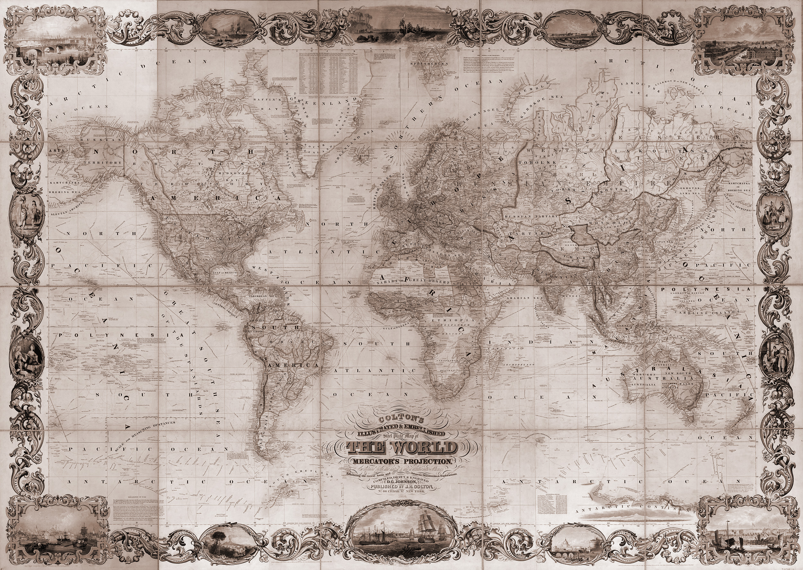
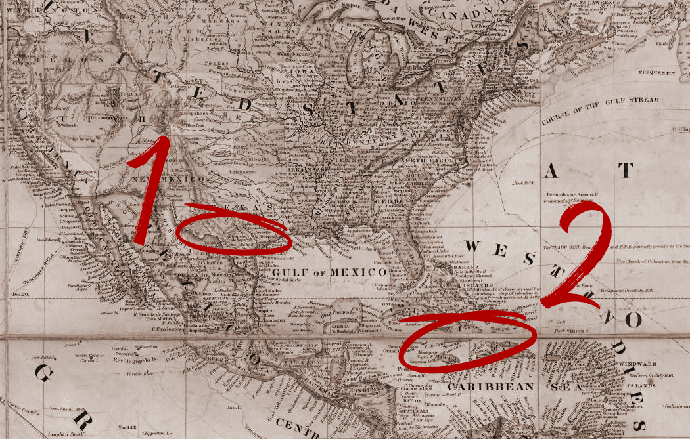

  

# HALLO UND WILLKOMMEN ZU UNSERER SERVER LORE!

Vielen Dank, dass ihr euch die Zeit nehmt, euch hier über das Spielen auf „Der Wilde Westen“ im Jahr 1875 zu informieren.
Um bei uns authentisches Roleplay zu spielen und uns gemeinsam mehr Richtung Hardcore zu bewegen, ist es für uns wichtig, euch besser darüber aufzuklären, in welchem Rahmen wir den Wilden Westen bespielen möchten, an welchen Punkten wir festhalten und wo wir abweichen. 

### VORAB SEI GESAGT

Wir alle haben uns bewusst für Roleplay, also für das Leben eines fiktiven Charakters in diesem rauen Setting entschieden.
Wir sind alle hier, um gemeinsam das Zusammenleben im westlichen Grenzland nachzuspielen und sollten daher immer bemüht sein, unser RP entsprechend diesem Setting zu gestalten. Egal, für welche Charakterstory ihr euch entscheidet, welche Vergangenheit ihr ihm gebt und welche Zukunft ihr mit ihm anstrebt - denkt stets darüber nach, zu welcher Zeit wir spielen und welches Handeln für diesen Zeitraum historisch sinnvoll ist oder nicht.
Viele Tipps dazu findet ihr in unserem „RP-Guide für Dummies“ und unseren Geschichts-Channeln auf dem offiziellen Discord.

## ALLGEMEINE HINTERGRUNDGESCHICHTE

„Der Wilde Westen“ spielt in einem fiktiven State namens „Dakoma“ im südwestlichen Grenzland der USA im Jahre 1875. Der Name darf von vornherein als bekannt sowie von den einst dort lebenden indigenen Völkern übernommen ausgespielt werden.

Real existierten die Dakota, Nakota und Lakota als Zweige der Sioux-Nationen, auf „Der Wilde Westen“ fügen wir als weiteren kleinen Stamm die fiktiven Dakoma ein, die jedoch in den sogenannten „Plains Wars“, die von ca. 1854 bis 1870 vom heutigen North Dakota bis hinunter nach Texas wüteten, restlos ausgelöscht wurden.

Im Jahr 1875 gab es historisch korrekt in den USA 37 Bundesstaaten und damit auch 37 Sterne auf der Flagge. Die 13 Gründungsstaaten waren, in chronologischer Reihenfolge:

| Nr. | Bundesstaat    | Beitrittsdatum    |
|-----|----------------|-------------------|
| 1.  | Delaware       | 7. Dezember 1787  |
| 2.  | Pennsylvania   | 12. Dezember 1787 |
| 3.  | New Jersey     | 18. Dezember 1787 |
| 4.  | Georgia        | 2. Januar 1788    |
| 5.  | Connecticut    | 9. Januar 1788    |
| 6.  | Massachusetts  | 6. Februar 1788   |
| 7.  | Maryland       | 28. April 1788    |
| 8.  | South Carolina | 23. Mai 1788      |
| 9.  | New Hampshire  | 21. Juni 1788     |
| 10. | Virginia       | 25. Juni 1788     |
| 11. | New York       | 26. Juli 1788     |
| 12. | North Carolina | 21. November 1789 |
| 13. | Rhode Island   | 29. Mai 1790      |

Später kamen dann wie folgt dazu:

| Nr. | Bundesstaat   | Beitrittsdatum                                      |
|-----|---------------|-----------------------------------------------------|
| 14. | Vermont       | 4. März 1791                                        |
| 15. | Kentucky      | 1. Juni 1792                                        |
| 16. | Tennessee     | 1. Juni 1796                                        |
| 17. | Ohio          | 1. März 1803 (offiziell anerkannt 1953 rückwirkend) |
| 18. | Louisiana     | 30. April 1812                                      |
| 19. | Indiana       | 11. Dezember 1816                                   |
| 20. | Mississippi   | 10. Dezember 1817                                   |
| 21. | Illinois      | 3. Dezember 1818                                    |
| 22. | Alabama       | 14. Dezember 1819                                   |
| 23. | Maine         | 15. März 1820                                       |
| 24. | Missouri      | 10. August 1821                                     |
| 25. | Arkansas      | 15. Juni 1836                                       |
| 26. | Michigan      | 26. Januar 1837                                     |
| 27. | Florida       | 3. März 1845                                        |
| 28. | Texas         | 29. Dezember 1845                                   |
| 29. | Iowa          | 28. Dezember 1846                                   |
| 30. | Wisconsin     | 29. Mai 1848                                        |
| 31. | California    | 9. September 1850                                   |
| 32. | Minnesota     | 11. Mai 1858                                        |
| 33. | Oregon        | 14. Februar 1859                                    |
| 34. | Kansas        | 29. Januar 1861                                     |
| 35. | West Virginia | 20. Juni 1863                                       |
| 36. | Nevada        | 31. Oktober 1864                                    |
| 37. | Nebraska      | 1. März 1867                                        |

Unseren fiktiven State „Dakoma“ siedeln wir als offiziell anerkannten 38. State der USA an. Mit Rückrechnung auf das reale Eröffnungsdatum des Servers am 4. Dezember 2021 und unter Berücksichtigung der historischen Tatsache, dass States in der Vergangenheit traditionell immer erst zum nächsten 4. Juli formell aufgenommen wurden, ergibt sich daher:

**38. Dakoma**
- am 4. Dezember 1870 → Antrag zur Anerkennung
- seit 4. Juli 1871 durch den 38. Stern auf der Flagge offiziell anerkannt
- seit 4. Dezember 1871 offizielle Grenzöffnung als spielinterner Feiertag

::: danger TERRITORY'S VS. STATES
Die heute bekannten, restlichen States waren damals noch sogenannte „Territories“ und keine States. Da diese erst nach 1875 anerkannt wurden, ist es für uns aus RP-Sicht nicht weiter relevant, soll hier der Vollständigkeit halber dennoch aufgelistet werden:

Colorado Territory → ab 1876: 38. Colorado
Dakota Territory (Teil) → ab 1889: 39. North Dakota
Dakota Territory (Teil) → ab 1889: 40. South Dakota
Montana Territory → ab 1889: 41. Montana
Washington Territory → ab 1889: 42. Washington
Idaho Territory → ab 1890: 43. Idaho
Wyoming Territory → ab 1890: 44. Wyoming
Utah Territory → ab 1896: 45. Utah
Indian Territory + Oklahoma Territory → ab 1907: 46. Oklahoma
New Mexico Territory → ab 1912: 47. New Mexico
Arizona Territory → ab 1912: 48. Arizona
Alaska Territory → ab 1959: 49. Alaska
Hawaii Territory → ab 1959: 50. Hawaii

Im Zuge eurer Charstory ist daher darauf zu achten, dass euer Char z.B. nicht aus „Arizona“ kommt, sondern aus „Arizona Territory“ und die Grenzen der Staaten damals auch anders verliefen als heute.  
:::

Da wir zeithistorisch möglichst authentisch spielen möchten, sind auch Kriege wie beispielsweise der Mexikanisch-Amerikanische Krieg (1846-48), der Sezessionskrieg (1861-65) sowie daraus resultierende Entwicklungen bekannt. Entsprechend gebildeten Charakteren oder Einwanderern aus anderen Ländern sind natürlich auch die Geschehnisse außerhalb Amerikas bekannt. Was nach 1874 real geschehen ist, ist uns im Roleplay natürlich nicht bekannt - und hier beginnt unsere gemeinsame, ganz eigene Geschichte.

::: danger WICHTIG
Was wir jedoch nach unserem Regelwerk nicht bespielen, sind schwere Beleidigungen sowie Rassismus, Sexismus, sexuelle Belästigungen, Handlungen und Vergewaltigung.
Jeder Spielerin und jedem Spieler sollen prinzipiell alle beruflichen Möglichkeiten und authentische Verhaltensweisen offenstehen.
:::

## Weltkarte 1875

Eine aktuelle Weltkarte von 1875, welche IC verwendet werden darf (sofern der Charakter davon Kenntniss haben kann).

Wer sich die Weltkarte genauer anschauen möchte, die Karte stammt von [hier](https://www.loc.gov/item/2009579466/).

Unser State liegt irgendwo im `südwestlichen Grenzland (1)` knapp oberhalb von Mexico und unterhalb von Texas, Guarma darf als eine `reale karibische Insel (2)` neben Kuba ausgespielt werden.

## UNTERTEILUNG VON DAKOMA

Der State Dakoma unterteilt sich in 5 Counties:

### County Lemoyne

Lemoyne, umgeben von Wasser des Flat Iron Lakes im Westen und im Süden und Osten vom Lannahechee River, unterteilt sich in zwei geografische Gebiete.
Ganz im Osten befindet sich das sumpfige Marsch- und Überschwemmungsgebiet des Bayou Nwa, welches auch die Hauptstadt Saint Denis beheimatet.
Im westlichen Teil liegt Scarlett Meadows, Farmland mit sanften Hügeln und der roten Erde, für die die dortige Ortschaft Rhodes bekannt ist.

### County New Hanover:

New Hanover erstreckt sich von den östlichen Wäldern der Roanoke Ridge und den dortigen Minen, über die weiten Ebenen der Heartlands, die prädestiniert sind für Rancher mit Vieh- und Getreidefarmen. Die zugehörigen Städte sind Annesburg im Norden, Van Horn im Osten und westlich Valentine mit seinem großen Viehmarkt.

### County Ambarino:

Diese gebirgige Region im Norden ist unwegsam und dünn besiedelt. Es umfasst die Grizzlies East und Grizzlies West, bekannt für gefährliche Wildtiere, extreme Wetterbedingungen sowie die dort lebenden Indianerstämme.

### County West Elizabeth:

Bestehend aus den Regionen Tall Trees, Big Valley und den Great Plains. Die Stadt Blackwater ist ein aufstrebender, moderner Hafenort an den Ufern des Flat Iron Lakes, während Strawberry weiter nördlich bekannt für seine Holzverarbeitung ist.

### County New Austin:

Die trockene Prärieregion ist bekannt für Bergbau und Ranching.
Während Armadillo eine recht zentral gelegene und gut ausgebaute Siedlung ist, ist Tumbleweed ganz im Westen des Gebiets eher Unterschlupf für zwielichtige Persönlichkeiten geworden.

### Die Insel Guarma:

Guarma ist eine nordöstlich von Kuba gelegene Insel, bekannt für den Anbau von Zuckerrohr und dessen Weiterverarbeitung zu Rum. Eine wunderschöne Tropeninsel, auf der jedoch von der dortigen Miliz eigene Regeln durchgesetzt werden.

## FRAKTIONEN AUF DER WILDE WESTEN RP

Zu den auf „Der Wilde Westen“ staatlichen Fraktionen gehören:
- Government
- United States Marshal Service
- Sheriffs/Lawmen
- Kavallerie

Weitere Fraktionen:
- Zeitung & Post Department
- Zivilisten (Siedler, Gewerbetreibende & Kleinkriminelle)
- Eisenbahn (CTC)
- Thieves Landing (Verwaltung Crime & Schwerkriminelle)