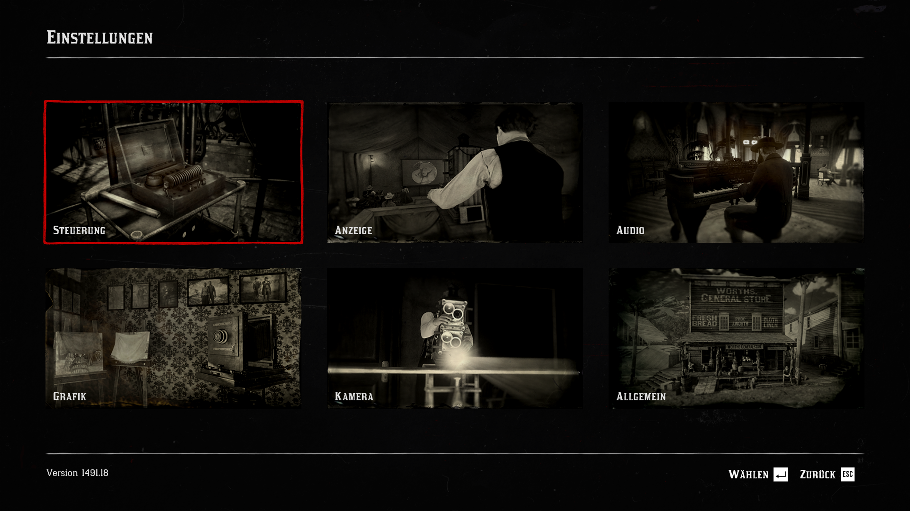
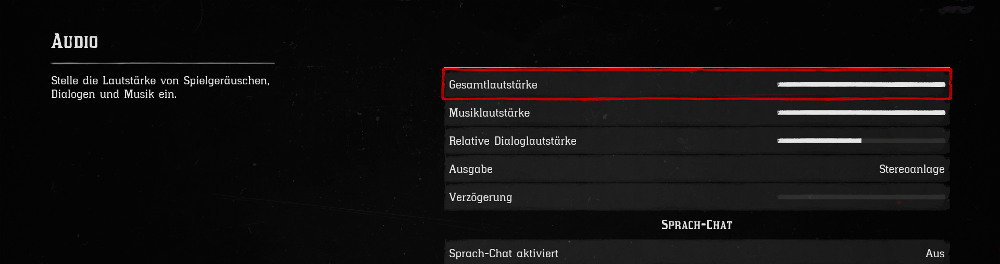

# INGAME VOICE

Da wir [SaltyChat](saltychat.md) benutzen, wird der Ingame Voicechat von Red Dead Redemption 2 nicht verwendet. Um globales Sprechen zu verhindern ist es erforderlich den Build-In Voicechat zu deaktivieren.

## Deaktivieren des RDR2-Voicechats

### 1. Schritt

Öffne die Einstellungen von Red Dead Redemption 2.

### 2. Schritt

Navigiere zu `Audio` und setze `Sprach-Chat aktiviert` auf `Aus`.

