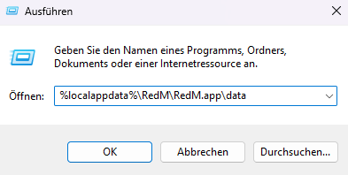
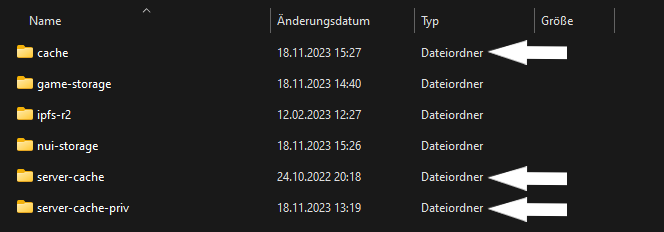

# CACHE LÖSCHEN

Drücke `WIN`+`R` und gebe `%localappdata%\RedM\RedM.app\data` in die Adressleiste ein.

Gehe anschließend in den Ordner `RedM Application Data` und lösche die unten aufgelisteten Ordner.

- cache
- server-cache
- server-cache-priv

