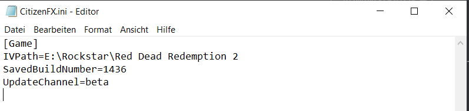

# REDM AKTUALLISIERUNG ÄNDERN

Wenn sich der RedM-Launcher aufgrund von Updates nicht öffnen lässt und es angekündigt ist, die Version umzustellen, könnt ihr das in folgender Datei anpassen.

:::warning WANN SOLLTE ICH DAS ÄNDERN?
Die Version sollte nur geändert werden, wenn vorher im Ankündigungschannel auf dem Discord eine entsprechende Ankündigung erfolgt ist. Beachtet zur aktuellen Channel-Version immer die Meldungen des Serverteams im [Discord](https://discord.gg/dww-rp).
:::

### 1. Schritt

Geht in den Ordner, wo RedM installiert ist öffnet den Ordner `RedM Application Data`.

### 2. Schritt

Öffnet die Datei `CitizenFX.ini`.

### 3. Schritt

Ändere den UpdateChannel auf `beta` für Beta und auf `canary für Latest (Unstable).

