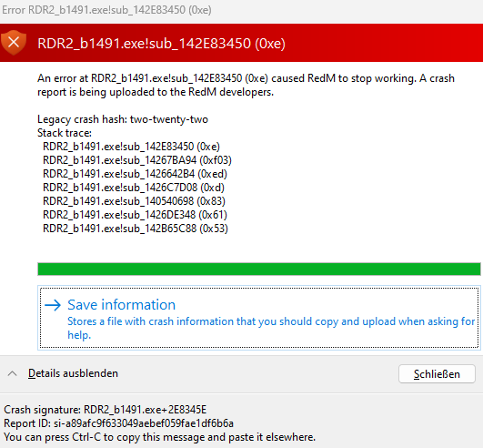
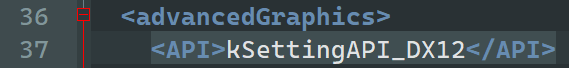

# RDR2_b1491.exe!sub_142E83450 (0xe)

_Aussehen der Fehlermeldung:_

## Lösung

1. Gehe in den Roaming-Ordner (`WIN` + `R` & dann "%appdata%" eingeben, anschließend `ENTER` drücken).
2. Gehe in den "CitizenFX"-Ordner.
3. Gehe in den "rdr3_settings"-Ordner.
4. Öffne die Datei "`system.xml`" mit dem Editor/Notepad/Notepadü++/etc.
5. Ändere die Zeile "`<API>kSettingAPI_Vulkan</API>`" zu "`<API>kSettingAPI_DX12</API>`"
6. Speichere die Datei ab.

Anschließend sieht die Datei wie folgt aus:

