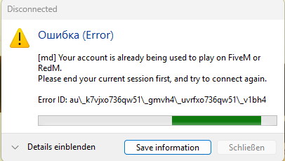
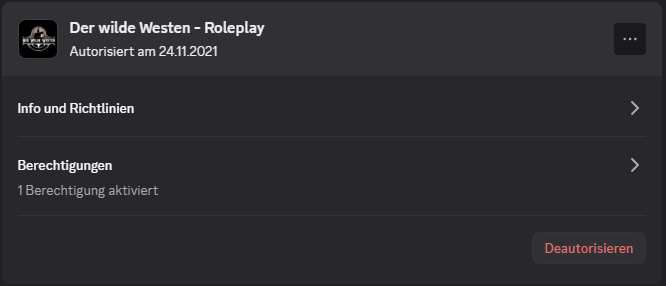

# ACCOUNT IS ALREADY BEING USED

_Aussehen der Fehlermeldung:_

## Lösung

1. `Discord -> Einstellungen -> Autorisierte Apps -> Der Wilde Westen - Roleplay` deautorisieren.
2. Bei Discord (auch im Browser!), Steam/Epic/Rockstar Launcher, RedM überall ausloggen und die Programme komplett schließen.
3. `Windows-Taste` + `R` auf der Tastatur drücken, im Fenster dann `%localappdata%` eingeben und bestätigen.
4. Im Ordner, der sich nun öffnet, den Unterordner `DigitalEntitlements` löschen
5. Nun mit den richtigen Zugangsdaten bei Discord, Steam/Epic/Rockstar Launcher und RedM wieder einloggen.
6. Auf den Server connecten, die App `Der Wilde Westen - Roleplay` sollte sich von selbst wieder autorisieren.
7. Spielen 🙂
   
Dieser Schritt muss ggfs. immer wiederholt werden, solange auf einem PC mit 2 verschiedenen Accounts gespielt wird. Dies ist von uns leider nicht fixbar.

