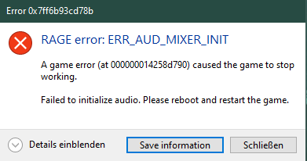

# ERR_AUD_MIXER_INIT

Der Fehler `ERR_AUD_MIXER_INIT` ist ein Fehler von Red Dead Redemption 2, nicht von RedM.
Dies ist die Fehlermeldung, welche Ihr erhaltet:

## Lösung

In den Windows-Einstellungen könnt ihr euer Headset speziell auf eine Software einstellen (`Einstellungen` > `Töne` > `Erweiterte Soundoptionen`). Wenn ihr auf zurücksetzen klickt, sollten alle Werte zurückgesetzt werden und die Lautsprecher/Kopfhörer, die für RDR2 verwendet werden, sollten "Standard" sein.

Wenn du deine Kopfhörer aussteckst, erkennt sie Windows nicht mehr und hat daher noch keinen Ton mehr. Wenn ein bestimmtes Paar Kopfhörer/Lautsprecher für Red Dead Redemption 2 bzw. RedM eingesetzt wurden ist die Ausgabe verschwunden und somit kann auch kein Ton abgespielt werden.