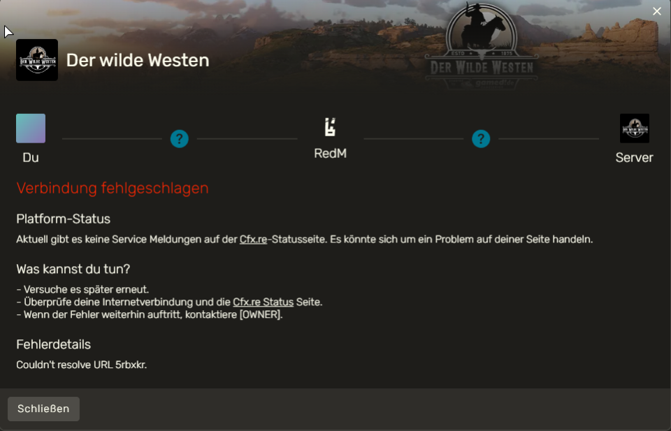

# COULDN'T RESOLVE URL

Dieser Fehler kann auftreten, wenn ein Lag seitens RedM vorliegt oder bestimmte Dienste von RedM temporär außer Betrieb sind.

_Aussehen der Fehlermeldung:_

## Lösung

Starte RedM wie gewohnt, öffne im Startbildschirm mit `F8` die Konsole und gib dort `connect 193.111.198.190:30120` ein. Drücke anschließend `ENTER` um die Eingabe zu bestätigen.