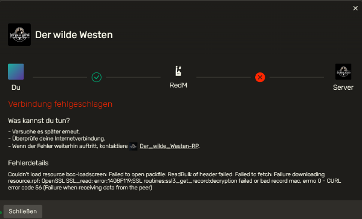

# CURL ERROR CODE 56

Dieser Fehlermeldung tritt auf, wenn RedM ein Fehler bei der Datenabfrage vom Server bekommt. Hierbei hilft nur ein Server-Restart unsererseits.

_Aussehen der Fehlermeldung:_

:::warning ACHTUNG
Sollte der Fehler vermehrt auftreten, werden wir den Server einmal zwischen unseren Restart Zeiten neustarten. Wenn dieser Fehler jedoch nur vereinzelt auftritt, musst du bedauerlicherweise bis zum nächsten Serverrestart abwarten.
:::
