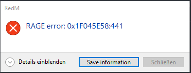

# RAGE ERROR: 0x1F045E58:441

Bei der 441-Fehlermeldung hilft nur ein Neustart des Servers. Da müsst ihr einfach Ruhe bewahren und den nächsten Restart abwarten. Um nicht alle Spieler aus ihrem laufenden RP-Strängen zu reißen, bitten wir um euer Verständnis, dass wir nicht für _einzelne Spieler_ den Server neustarten werden.

:::warning ACHTUNG
Sollten viele Spieler von dem Problem betroffen sein kann es sein, dass wir einen ungeplanten Restart ansetzen. Sollte bei euch das Problem auftreten wäre es gut, wenn Ihr uns darauf aufmerksam macht, das dieses Problem existiert.
:::

_Aussehen der Fehlermeldung:_
