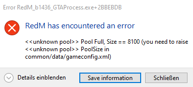

# REDM POOLSIZE

_Aussehen der Fehlermeldung:_

## Lösung

### 1. Schritt

Öffne den `Installationsordner` von RedM und navigiere in `RedM Application Data` > `citizen` > `common` > `data`.

### 2. Schritt

Öffne die Datei `gameconfig.xml` mit einem Editor deiner Wahl.

### 3. Schritt

Drücke in dem Editor `STRG`+`F` und suche nach dem Wert `8100`.

### 4. Schritt

Ändere den gefundenen Wert von `8100` auf `16200` und speichere die Datei.

> Du kannst nun alle Fenster schließen und RedM wie gewohnt starten.