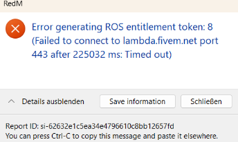

# Error generating ROS entitlement token: 8

Dieser Fehler tritt auf, wenn euer Antivirenprogramm den Zugriff für RedM blockiert.

_Aussehen der Fehlermeldung:_

::: warning DISCLAIMER
Abhängig von deinem Antivirenprogramm sehen die Einstellungen anders aus.
In unserem Beispiel arbeiten wir mit dem bereits integrierten Antivirenschutz von Windows.
:::

1. Gib in der Windows Suchleiste “`Windows Defender Firewall`” ein und öffne das Programm.

2. In dem soeben geöffneten Fenster gehst du links auf die Schaltfläche “`Eine_ App oder ein Feature durch die Windows Defender Firewall zulassen`”.

::: warning ZWISCHENSCHRITT
Überprüfe in der Programmliste erst ob RedM eventuell schon angezeigt wird. Scrolle dafür runter bis zum Buchstaben R und suche nach redM.exe. Sollte dies der Fall sein, setze ein Harken in “`Öffentlich”. Du kannst folgende Schritte überspringen und direkt zu Schritt 3. gehen.
:::

3. Klicke oben rechts auf “`Einstellungen ändern`”. Gehe rechts nach unten auf die Schaltfläche “`Andere App zulassen`”.

4. Geh auf “`Durchsuchen`” und such den Ordner heraus, in dem deine `RedM.exe` abgelegt ist.

::: warning
Solltest du nicht wissen wo du diesen findest, kannst du in der Windows Suchleiste nach RedM suchen. Auf RedM mit rechtskick den Datenspeicherort öffnen und auf die RedM Verknüpfung nochmal mit rechtsklick einen Datenpfad öffnen. Oben wird dir dann der Datenpfad angezeigt, diesen suchst du dann genau so im Windows Defender heraus.
:::

5. Mache einen *Doppelklick* und füge die RedM durch die Schaltfläche “`Hinzufügen`” zu. Setze zum Schluss noch ein Harken in den Kasten “`Öffentlich`”.

6. Starte den Rockstar Launcher und den Launcher über welchen du Red Dead Redemption 2 gekauft hast und starte dann RedM. 

7. Zuletzt bestätigst du beim Start von RedM den Zugriff für dein öffentliches und private Netzwerk.