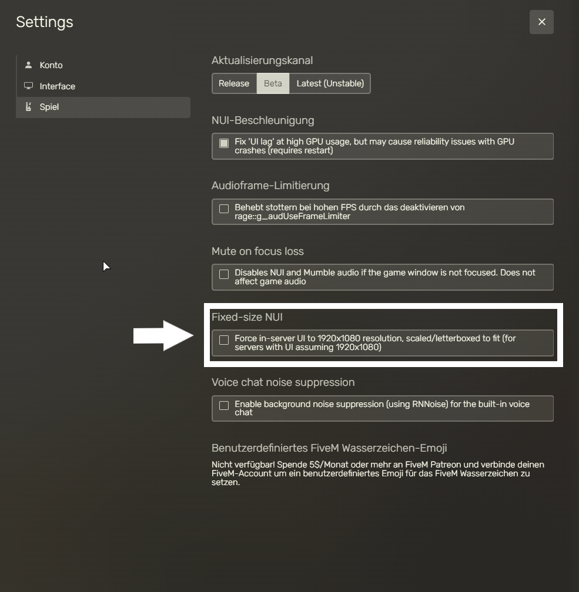

# UI-GRÖßE

Solltest du auf einer Auflösung spielen, welche `1920x1080` Pixel übersteigt ist es möglich, dass einige Ingame-Menus nicht richtig angezeigt werden. Solltest du dieses Problem feststellen ist die einfachste Lösung, das UI von RedM auf `1920x1080` Pixel zu fixieren.

Öffne dazu RedM, gehe in die Einstellungen unter `Spiel` und aktiviere `Fixed-size NUI`.

