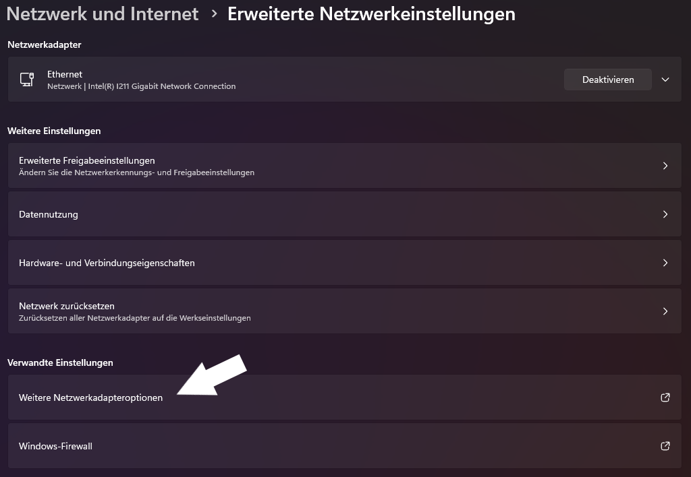

# SALTYCHAT MOVED NICHT

<Badge type="warning" text="Sollte die hier beschriebene Lösung nicht funktionieren wende dich an unseren Support."/>

Es kann aufgrund von falscher DNS Auflösung zu einem Problem können, bei dem SaltyChat dich nicht in den Ingame-Channel auf TeamSpeak zieht. Befolge die unten beschriebenen Schritte um das Problem zu beheben.

## Methode #1

### Schritt 1

Mache ein `Rechtsklick` auf das `Windows-Logo` auf deiner Taskleiste und gehe auf `Netzwerkverbindungen`.


### Schritt 2

Klicke auf `Erweiterte Netzwerkeinstellungen`.


### Schritt 3

Klicke auf `Weitere Netzwerkadapteroptionen`.



### Schritt 4

In diesem Fenster sollte unter anderem das Gerät `Ethernet` (wenn du per Ethernetkabel/LAN verbunden bist, sonst das Gerät WLAN) aufgelistet sein, mache einen `Rechtsklick` auf das Gerät, anschließend gehe auf `Eigenschaften`.


### Schritt 5

Mache ein Doppelklick auf `Internetprotokoll, Version 4 (TCP/IPv4)`. In der unteren Auswahl, wähle `Folgende DNS-Serveradressen verwenden` und trage die in der Tabelle stehenden Werte wie in dem Bild zu sehen ein.

| Eintrag                 |    Wert |
| :---------------------- | ------: |
| Bevorzugter DNS-Server  | 8.8.8.8 |
| Alternativer DNS-Server | 8.8.4.4 |


Bestätige deine Auswahl mit `OK`.

### Schritt 6

Mache ein Doppelklick auf `Internetprotokoll, Version 6 (TCP/IPv6)`. In der unteren Auswahl, wähle `Folgende DNS-Serveradressen verwenden` und trage die in der Tabelle stehenden Werte wie in dem Bild zu sehen ein.

| Eintrag                 |                 Wert |
| :---------------------- | -------------------: |
| Bevorzugter DNS-Server  | 2001:4860:4860::8888 |
| Alternativer DNS-Server | 2001:4860:4860::8844 |


Bestätige deine Auswahl mit `OK`.

----

> Du kannst nun alle Fenster von den Einstellungen schließen und es erneut versuchen.

----

## Methode #2
<Badge type="tip" text="Für Experten."/>
<Badge type="warning" text="Danke an miles_morales_1610 für diese Variante."/>

1. Starte PowerShell im Administrator Modus.
2. Füge folgenden Befehl in PowerShell ein: 
````
"`n127.0.0.1 lh.saltmine.de #saltychat fix`n127.0.0.1 lh.v10.network #saltychat fix" | Add-Content -Path C:\Windows\System32\drivers\etc\hosts
````
3. Bestätige deine Eingabe mit `ENTER`.
