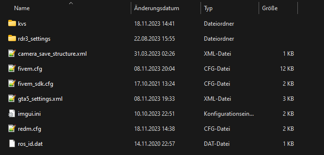
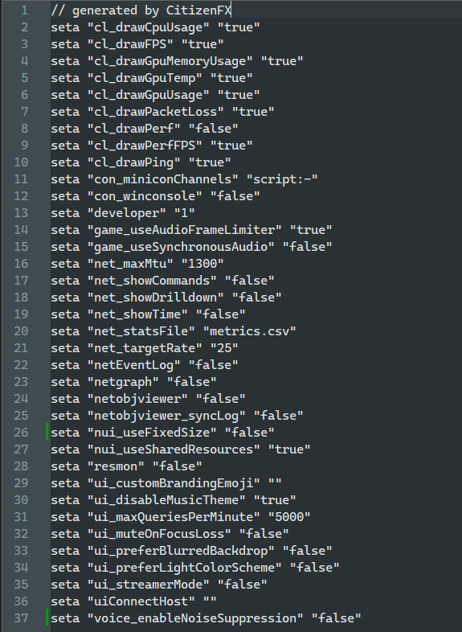

# UI-LAG
<Badge type="warning" text="Fehlerbehebung durch Nykatas."/>

Teilweise kann es vorkommen, dass Ingame-UIs (z.B. Inventar, F6-Menu, Telegramm-Menu, etc.) eine sehr starke Verzögerung haben. Ihr könne dieses Problem lösen, indem Ihr die unten beschriebenen Schritt befolgt.

### Schritt 1

Öffne den `Speicherordner von RedM` (Normalerweise findet ihr den Ordner indem ihr nach _`C:\Users\[Nutzer]\AppData\Roaming\CitizenFX`_ | => [Nutzer] durch euren Windows-Benutzername ersetzen | navigiert).



### Schritt 2

Öffne die Datei `redm.cfg`.



### Schritt 3

Füge in der Datei eine Zeile hinzu, welche foldendes enthällt:

```txt
seta "nui_useInProcessGpu" "true"
```

### Schritt 4

Speichere die Datei `redm.cfg`. Du kannst nun alle anderen Fenster schließen und RedM starten - der UI-Lag ist damit behoben.

:::tip RED DEAD REDEMPTION 2 EINSTELLUNGEN
In manchen Fällen können lange Ladezeiten beim öffnen von Menus ebenfalls reduziert werden, wenn in den Einstellungen von Red Dead Redemption 2 in den Grafikoptionen die `Dreifachpuffer` Einstellung auf `Aus` gestellt wird. 
:::