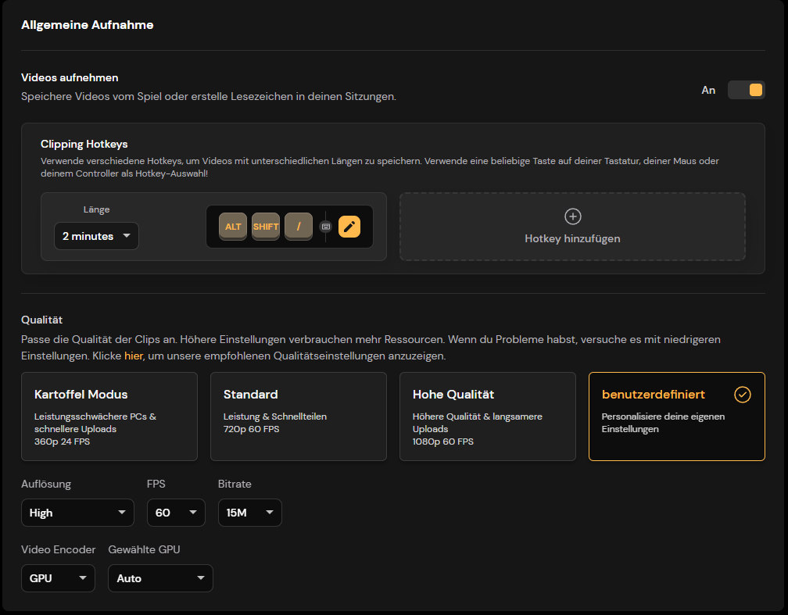
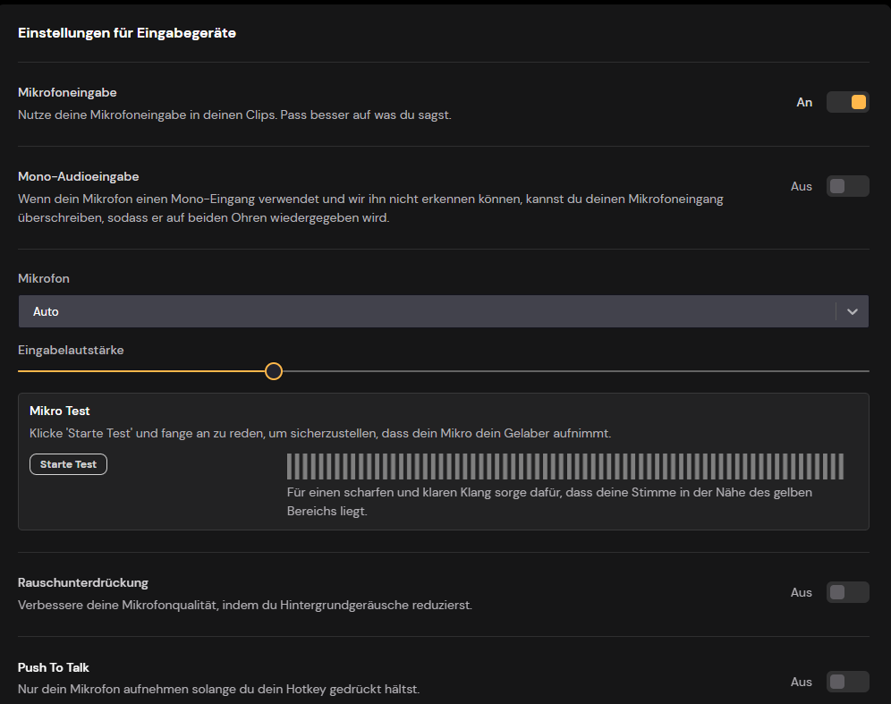

# MEDAL.TV - INSTALLATIONSGUIDE
<Badge type="tip" text="Von Der Wilde Westen RP empfohlen."/>

Gehe zum Installieren des Programmes auf die [Website](https://medal.tv/de) von Medal.tv und klicke oben rechts auf `Für Windows herunterladen`. Sobald der Download abgeschlossen ist, öffne das Installationsprogramm und befolge alle Schritte, welche das Programm vorgibt.

Sobald die Installation abgeschlossen ist, wirst du aufgefordert, einen Hotkey zu wählen. Wenn du die Standardtaste nicht verwenden möchten, kannst du hier selbst einen Taste bzw. Tastenkombination festlegen.

Direkt nach dem Drücken des Hotkeys erklingt ein Ton und und dein Clip der letzten Minuten wurde gespeichert. Die Aufnahmeparameter sind in dein Einstellungen änderbar.

