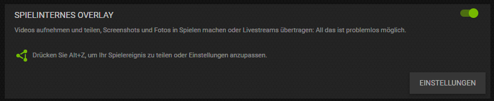
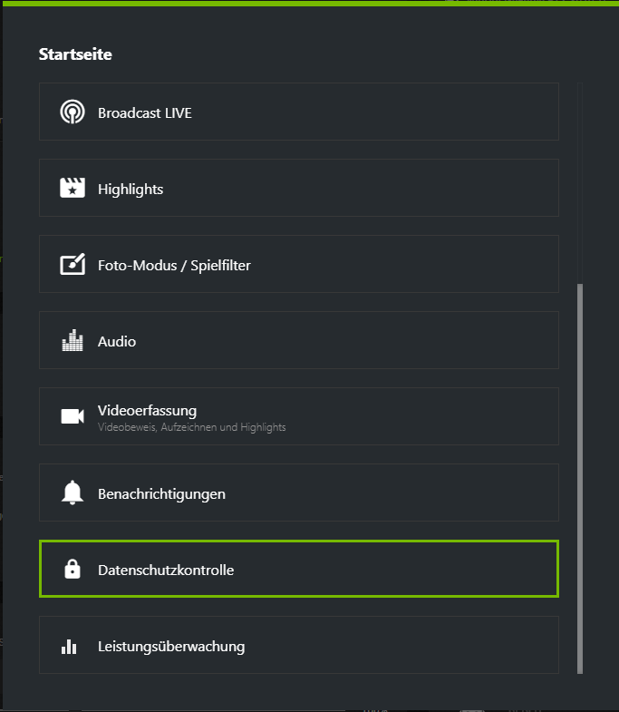
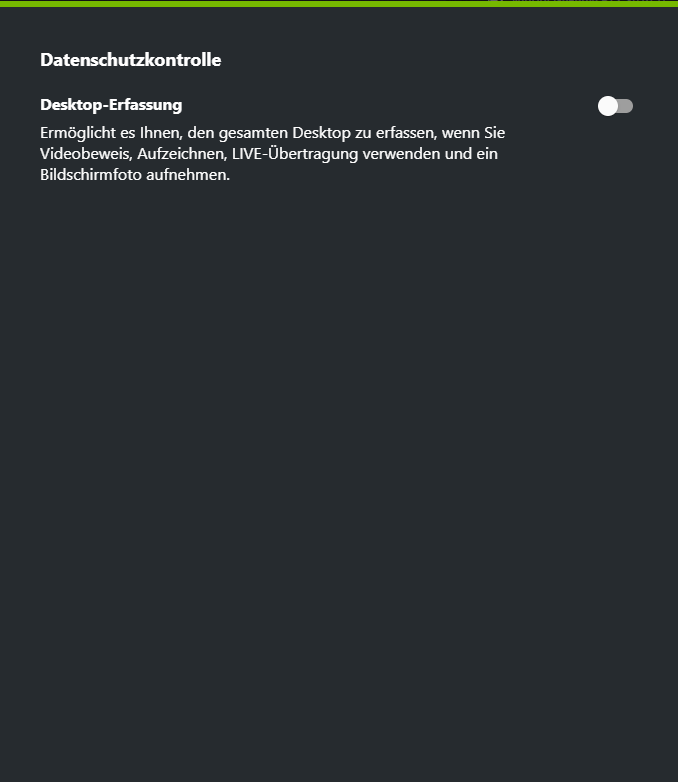

# NVIDIA SHADOWPLAY

"ShadowPlay ist die einfachste Methode, mit der du Gameplay-Videos in hoher Auflösung, Screenshots und Livestreams aufzeichnen und mit deinen Freunden teilen kannst."  _~ NVIDIA_

## Installation

Anbei findest du ein Video wie du NVIDIA Shadowplay mit RedM (_gleicher Prozess wie bei FiveM_) verwendest.

## Desktop Aufnahme aktivieren

Starte `GeForce Experience` und öffne die Einstellungen. Aktiviere anschließend das `Spielinterne Overlay` und gehe dort in die Einstellungen.

Scrolle nach unten und navigiere zu `Datenschutzkontrolle`.

Aktiviere hier die `Desktop-Erfassung` - du kannst das Menu nun schließen.

