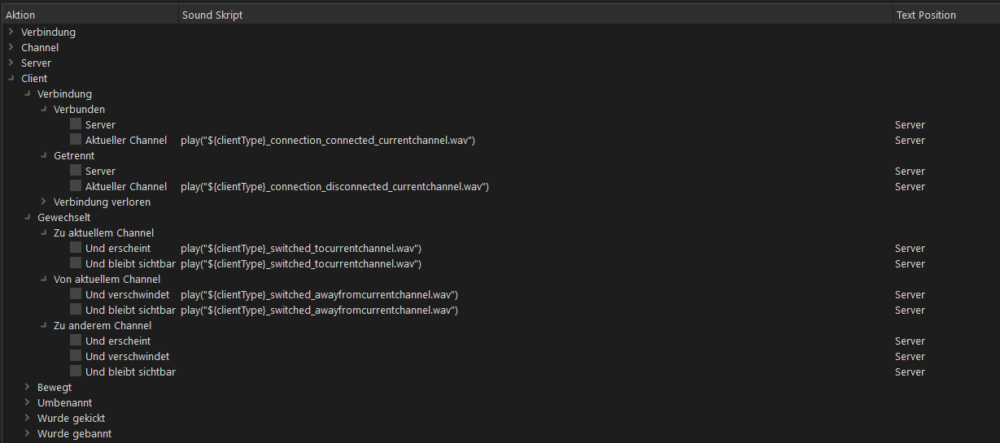
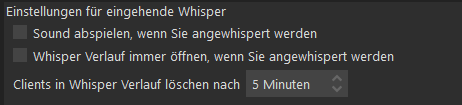

# TEAMSPEAK SOUNDS

TeamSpeak sendet beim betreten von Channeln sowie dem Disconnect eine Audio-Benachrichtigung, das kann nach einer Zeit sehr störend werden - besonders wenn man sich gerade im Roleplay befindet.

## TeamSpeak Sounds deaktivieren

Zum deaktivieren der TeamSpeak Join/Leave Sounds gehe in die TeamSpeak Einstellungen (`ALT+P`), anschließend zu `Meldungen` und entferne alle Haken der Unterpunkte im Menu `Client`.

## Whisper Sounds deaktivieren

Mit dem Update auf [SaltyChat v3.1.2](saltychat.md) ist das Sprach-System auf die Whisper Funktion umgestellt worden, dadurch erscheint jedes mal ein "Pssst!"-Sound sobald man miteinander spricht. Um diese Funktion zu deaktivieren gehe in die TeamSpeak Einstellungen (`ALT+P`), anschließend zu `Whispern` und deaktiviere "`Sound abspielen, wenn Sie angewhispert werden`".

