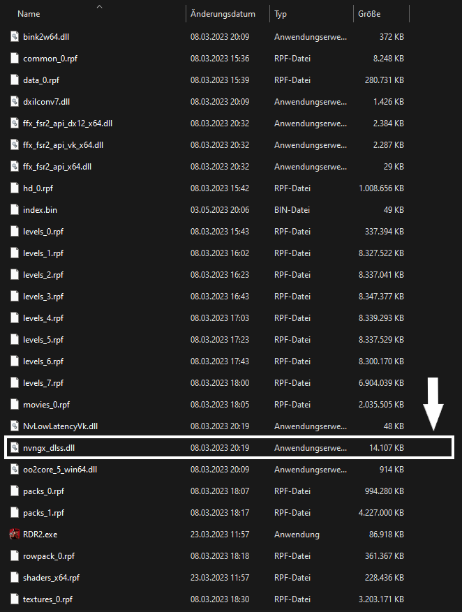

# REDM + DLSS

"DLSS ist ein revolutionärer Durchbruch bei der KI-Grafik zur Steigerung der Leistung. DLSS 3 nutzt die neuen Tensor-Recheneinheiten der vierten Generation und den Optical-Flow-Beschleuniger auf Grafikkarten der GeForce RTX 40-Serie, um mithilfe von AI zusätzliche Frames zu erstellen und die Bildqualität zu verbessern." _~ NVIDIA_

## Wie kann ich RedM mit DLSS spielen?

Damit du RedM mit DLSS spielen kannst musst du die Datei `nvngx_dlss.dll` aus dem Installationsordner des Originalspiels kopieren und in den Ordner `RedM\RedM.app\data\cache\subprocess` kopieren.

