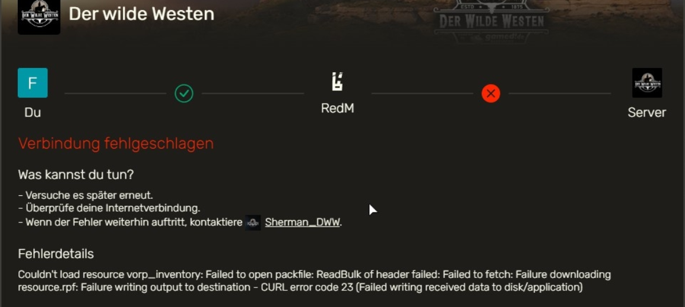

# CURL ERROR CODE 23

Dieser Fehler tritt unter anderem auf, wenn auf der Festplatte, wo RedM installiert ist, kein Speicher mehr vorhanden ist.

_Aussehen der Fehlermeldung:_

## Lösung

Deinstalliere nicht mehr benötigte Software und lasse gern auch die Windows-Interne Datenträgerbereinigung durchlaufen, um wieder mehr Platz auf deiner Festplatte verfügbar zu machen. <badge type="tip">Solltest du dafür Hilfe benötigen wende dich an unseren Support.</badge>