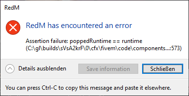

# POPPEDRUNTIME

_Aussehen der Fehlermeldung:_

Seitens RedM wird geraten, bei dieser Fehlermeldung alle `C++ Runtime Libraries` über `Programme deinstallieren` zu löschen und nur die letzte aktuelle Version von `Visual C++ Redistributable` über die [Microsoft-Website](https://learn.microsoft.com/en-us/cpp/windows/latest-supported-vc-redist?view=msvc-170) neu herunterzuladen.

Da wir selbst nicht die Anbieter von RedM sind, ist die oben beschriebene Lösung nur eine Hilfestellung und ohne Gewähr.